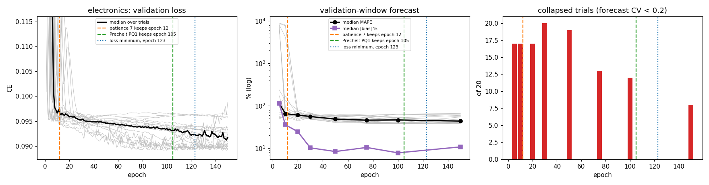
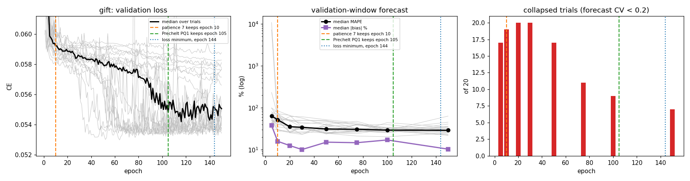
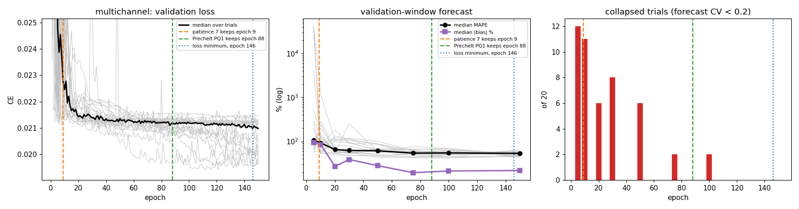
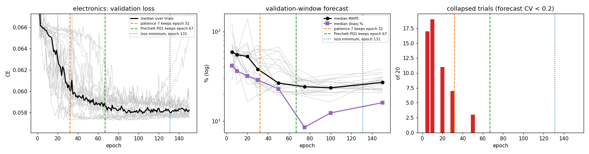

# Hyperparameter search

How the Optuna search that picks every neural model is set up, how each piece compares
with standard practice, what was measured, and what is still to test. Model selection
(whether the criterion picks the right trial) is in `docs/model-selection.md`; training
length is in `docs/insight-training-efficiency.md`.

It is not a grid search. Optuna's TPE sampler draws each trial's settings from what
earlier trials scored on the validation loss, so it concentrates on whatever that loss
favours. That makes the validation loss itself the first thing to get right (§3.1).

Conventions: every interval is a 95% percentile bootstrap from `evaluation.effects.effect`
(`docs/statistical-protocol.md`), and bold marks one that excludes 0. Family letters are
those of `docs/studies-run.md` §4.

## 0. Overview: every training configuration run

Every training configuration that has been run, which model ran it, on which panels, and
how many times, so it is clear which ones to keep.

**The refit is in every forecast.** The refit's settings date from 15 June 2026. ADR-0008
(commit `b2609d4`, 13 August) made it the only route to a forecast, and no study has
overridden them: all 16,850 stored study configs carry empty `refit_kwargs`. Every holdout
result below therefore comes from the same refit. The exceptions are the epoch probe (B3),
which forecasts only the validation window, and the four-study pilot (A3).

**Terms.**
- **Refit:** 5 epochs over the full calibration window at learning rate 1e-3, batch 512,
  no weight decay, with a fresh AdamW. It ignores the tuned settings (§3.5).
- **Validation loss:** the mean cross-entropy over the validation window. Early stopping
  reads it to pick the epoch, and the search reads it to pick the trial. One *cell* is one
  customer in one period, so the loss has one term per cell.
- **Biased validation loss:** how the loss was computed before 4 October 2026. It averaged
  each batch's mean, so the short last batch counted as much as a full one, and the value
  shifted with the batch size. It favoured batch 256 on electronics and multichannel
  (§3.1). Every search before that date used it.
- **Corrected validation loss:** the plain mean over every cell, the same at any batch
  size (ADR-0010).
- **Search:** TPE, 100 trials, over learning rate 1e-4–3e-3, weight decay 1e-6–1e-2 and
  batch {64, 128, 256}. ValendinLSTM searches nothing else; the LSTM also searches its
  widths and dropout.
- **Pruner:** `MedianPruner`, from the 4th epoch, after 5 finished trials. It is on in
  every searched configuration.
- **Runs:** studies × trials × Monte Carlo paths. One study is one complete search, refit
  and forecast.
- **Panels:** the 2y windows (cdnow, electronics, gift, multichannel), the 3y windows
  (electronics, gift, multichannel) and electronic_5y (the paper's cohort).

### A. Configurations scored on the holdout

**A1. Default:** patience 7, absolute threshold 1e-4, at most 100 epochs, search, pruner,
refit, biased validation loss.

| family (date) | model | inputs / arm | panels | runs |
| --- | --- | --- | --- | --- |
| N (13 Sep) | ValendinLSTM | count + week, the benchmark | 4 × 2y | 20 × 100 × 500 |
| W (26–28 Sep) | ValendinLSTM | count + week | 5y | 20 × 100 × 500 |
| O (13–14 Sep) | LSTM | 4 AR encodings | 4 × 2y | 100 × 100 × 500 per encoding |
| P (14–15 Sep) | LSTM | 4 AR encodings | 3 × 3y | 100 × 100 × 500 per encoding |
| T `archive` (20 Sep) | ValendinLSTM, LSTM | benchmark inputs | electronics | 20 × 100 × 200 |
| T′ `archive` (21 Sep) | ValendinLSTM, LSTM | same | cdnow | 20 × 100 × 200 |
| U `archive` (21 Sep) | ValendinLSTM, LSTM | no label / cluster label (`kmeans_8`) | 4 × 2y | 20 × 100 × 200 per cell |
| V (21 Sep) | ValendinLSTM, LSTM | same | electronics, cdnow | 40 and 5 per model × 100 × 100; every trial scored, not only the winner |


**A2. Default, corrected validation loss:** the same settings as A1, but the search and
early stopping read the corrected validation loss instead of the biased one. The search
space is the archive's, as in A1 (the registry has since pinned weight decay to 0 and
added batch 32).

| family | model | inputs | panels | runs |
| --- | --- | --- | --- | --- |
| U′ (4 Oct) | ValendinLSTM, LSTM | no label | electronics | 20 × 100 × 200 |
| SR `patience7` (7 Oct) | ValendinLSTM | count + week | all 8 panel-calibrations | 20 × 100 × 500 |

SR allows 200 epochs instead of 100; patience 7 reaches neither limit.

**A3. Default without refit:** the forecast comes from the trial's own checkpoint.

| run | model | panels | runs |
| --- | --- | --- | --- |
| pilot (24 Sep, not a family; §6.4) | LSTM; ValendinLSTM | electronics (3 studies); cdnow (1 study) | 121 trials in all, each forecast with and without the refit |

Too small to support a claim.

**A4. Notebook recipe, pinned (`paper`):** learning rate 1e-3, no weight decay, batch 32,
patience 5, at most 150 epochs. One trial, so no search; refit as usual.

| family | model | panels | runs |
| --- | --- | --- | --- |
| T | ValendinLSTM, LSTM | electronics | 20 × 1 × 200 |
| T′ | ValendinLSTM, LSTM | cdnow | 20 × 1 × 200 |

**A5. Notebook recipe with a 90-epoch floor** (`paper90`; `floored` in family U).

| family | model | inputs | panels | runs |
| --- | --- | --- | --- | --- |
| T `paper90` | ValendinLSTM, LSTM | benchmark | electronics | 20 × 1 × 200 |
| U `floored` | ValendinLSTM, LSTM | no label / cluster label | 4 × 2y | 20 × 1 × 200 per cell |

**A6. Default with a 50-epoch floor (`floor50`):** at most 300 epochs, with the pruner's
warm-up raised to the floor. Biased validation loss.

| family | model | panels | runs |
| --- | --- | --- | --- |
| T | ValendinLSTM, LSTM | electronics | 20 × 100 × 200 |
| T′ | ValendinLSTM, LSTM | cdnow | 20 × 100 × 200 |

**A7. Late weights only (`select_from_epoch`):** the settings of family W's least-biased
study, pinned (learning rate 2.2e-3, batch 32, no weight decay), patience 7, refit.

| family | model | rule | panels | runs |
| --- | --- | --- | --- | --- |
| X (26–27 Sep) | ValendinLSTM; LSTM + `ar_bounded_52`; LSTM + cluster label | weights from any epoch / epoch 20 on / epoch 30 on | 5y | 20 × 1 × 500 per cell |
| Y (27–28 Sep) | LSTMAttention, Transformer | searched, plus X's grid | 5y | 20 × 100 or 1 × 500 |

**A8. PQ1 with pruner:** Prechelt's PQ1 rule replaces patience 7 (§5.2). Search, pruner,
refit, corrected validation loss.

| family | model | panels | runs |
| --- | --- | --- | --- |
| SR `pq1` (7 Oct) | ValendinLSTM | all 8 panel-calibrations | 20 × 100 × 500 |

**Never run.**

| # | configuration | where owed |
| --- | --- | --- |
| A9 | PQ1 without the pruner, with refit | §5, test 1b |
| A10 | PQ1 without refit (forecast from the checkpoint) | §5, test 4 |
| A11 | refit at the tuned learning rate, keeping the optimiser state | §5, test 4 |
| A12 | the average of several refits | §5, test 4 |
| A13 | any configuration on today's registry search space (weight decay 0, batch 32 added) | — |

### B. Diagnostics (no holdout forecast)

| # | what | model | panels | runs |
| --- | --- | --- | --- | --- |
| B1 | early stopping off for 200 epochs, patience 7 replayed on the curve (`docs/insight-training-efficiency.md` §3.2) | ValendinLSTM, one fixed setting | electronics, multichannel, cdnow | 3 runs each |
| B2 | the notebook's split against ours, 120 epochs (same doc, §3.3–3.4) | notebook recipe | electronics | 1 + 3 runs |
| B3 | epoch probe: 150 epochs, no stopping, no pruning, no refit, forecast on the validation window at 8 checkpoints (§5.1–5.2) | ValendinLSTM, random settings | all 8 panel-calibrations | 20 trials each |
| B4 | refit noise: one checkpoint refit twice (family R; `docs/model-selection.md` §2) | ValendinLSTM | 4 × 2y | 698 refits |

### What to keep

- **Only one comparison is clean:** A2 against A8 (family SR). Both arms use the corrected
  validation loss, the same code and model, and all 8 panel-calibrations. Everything in
  A1 and A4–A7 used the biased one.
- **The floors and pinned recipes (A4–A7) were candidate fixes, now replaced by PQ1.** They
  remain evidence that patience 7 undertrains on electronics and multichannel, not
  settings to adopt.
- **The refit was never varied.** Apart from the four-study pilot (A3), every result rests
  on one untested refit.
- **Coverage is uneven.** ValendinLSTM has 20 runs per configuration and is the only model
  tested under PQ1. The LSTM's largest runs (O and P, 100 studies each) are all A1. The
  Transformer's training length is untested outside 5y.
- **No run uses today's registry search space.** U′ and SR restored the archive space so
  they compare with the old runs.

**Proposed decision.**
- **Baseline:** A2 (SR `patience7`).
- **Candidate default:** A8 (SR `pq1`).
- **Supporting evidence:** A1; T and U, bearing in mind they used the biased validation
  loss; B3.
- **Archived as superseded:** A4–A7.
- **To run next, ValendinLSTM, 20 per arm:** A9, and the refit variants A10–A12. The refit
  variants reuse the winners' checkpoints kept by SR's two arms, so they need no new
  searches.

## 1. How a study runs

One **study** is one search, its refit and its forecast. In order:

1. **Sample.** TPE, seeded `base_seed + i`, draws a trial's settings from the model's
   registry entry (`registry/model_registry.py`). Searched archives used 100 trials.
2. **Train.** `fit_model` (`training/loop.py`) trains with AdamW, gradient clipping at
   1.0 and cross-entropy against the count class, for at most `n_epochs` (100 in the
   archives).
3. **Stop early.** After each epoch it scores the validation window (ADR-0001). An epoch
   counts as an improvement only if it beats the best by an absolute 1e-4
   (`loop.py:377`). After `patience` epochs (7) without one, training stops, unless
   `min_epochs` has not been reached yet. The best epoch's weights are kept.
4. **Prune.** From the 4th epoch on, Optuna's `MedianPruner` stops a trial whose best loss
   so far is worse than the median of finished trials at the same epoch
   (`tuning/optuna_tuning.py:504`).
5. **Select.** The trial with the lowest validation loss wins.
6. **Refit.** The winner is fine-tuned for 5 epochs on the full calibration window at
   learning rate 1e-3 and batch 512 (`trials/refit.py`, ADR-0008).
7. **Forecast.** The refit model is rolled out over the holdout, averaged over 200–500
   paths.

### What is searched

| model | searched | fixed |
| --- | --- | --- |
| LSTM | hidden width {32, 64, 128}, dense width {32, 64, 128}, dropout 0–0.4, learning rate 1e-4–3e-3 (log), batch {32, 64, 128, 256} | embedder `valendin`, weight decay 0 |
| ValendinLSTM | learning rate 1e-4–3e-3 (log), batch {32, 64, 128, 256} | architecture 128/128, no dropout (ADR-0004); weight decay 0 |
| Transformer | `d_model` {32, 64, 128}, heads {2, 4, 8}, layers 1–3, dropout, learning rate, batch | embedder `valendin`, weight decay 0 |

**The archived searches used a different space.** Before 23 September 2026, weight decay
was searched over 1e-6–1e-2 (log) and batch over {64, 128, 256}; commits d7e902d and
57b8c18 pinned weight decay to 0 and added batch 32. Families T, T′, U and V
ran on the old space (and earlier families on older ones), so a rerun meant to reproduce
one must restore it (family U′ does, §4).

## 2. Against standard practice

| # | Piece | What this package does | Standard practice | Status |
| --- | --- | --- | --- | --- |
| 1 | Epoch loss | the per-sample mean (a sample is one customer-period) | the per-sample mean (Keras metrics, Lightning's epoch logging) | **fixed** in af2b14b (4 Oct): until then it averaged the per-batch means, ADR-0010 (§3.1) |
| 2 | Pruner | `MedianPruner`, warm-up 3 epochs, 5 startup trials | Optuna's defaults are warm-up 0, 5 startup trials; Optuna's own benchmark pairs **Hyperband** with TPE and the median rule with random search | open (§3.2) |
| 3 | Pruning unit | epochs | epochs: standard | noted (§3.2) |
| 4 | Improvement threshold | absolute 1e-4 | a threshold relative to the loss, or patience sized to the curve | open (§3.3) |
| 5 | Training floor | `min_epochs` under early stopping, pruner warm-up raised to match | not standard; a remedy for flat curves | open (§3.4) |
| 6 | Refit | lr 1e-3, batch 512, 5 epochs, fresh AdamW, whatever the search chose | fine-tune at the tuned learning rate or below | open (§3.5) |
| 7 | Sampler | TPE, seeded per study | standard | fine after #1 (§3.6) |

## 3. What was found

### 3.1 The validation loss depended on the batch size (fixed)

Until commit af2b14b, `validate_one_epoch` returned the mean of its per-batch means. The
validation loader runs at the trial's batch size, in fixed customer order, so the short
last batch counted as much as a full one. At batch 256 on electronics, the 61 highest-id
customers carried 25% of the validation loss instead of 7%.

Family U's stored winners, scored at every batch size with their weights fixed, against
the true mean over all customer-periods:

| panel | the short batch's loss vs average | batch 64 | batch 256 |
| --- | ---: | ---: | ---: |
| electronics | 0.79× | −0.1% | **−4.1%** |
| multichannel | 0.29× | −0.3% | **−6.2%** |
| cdnow | 1.35× | +0.2% | **+2.8%** |
| gift | 2.28× | +3.0% | **+13.4%** |

- **The bias outweighed the real differences.** The winning loss varies by only 0.08–3.1%
  across replications (`docs/model-selection.md` §2).
- **TPE followed it.** Batch 256 was drawn in 61% and 51% of all electronics and
  multichannel trials, against 8–9% on CDNOW and gift.
- **Its direction is an accident.** On electronics and multichannel the highest ids buy
  less than average; on CDNOW and gift, more.

**The fix** weights each batch by the cells it scored (`_batch_weight`, `loop.py:67`), so
the validation loss is the exact mean over all cells at any batch size. Shuffling the validation set was
rejected: at batch 256 it leaves a 95% range of ±3–9% around the true mean.

**The rerun** (family U′, electronics · `archive` · no cluster label, 20 replications per
model, `docs/model-selection.md` §3.9):

| | LSTM | ValendinLSTM |
| --- | --- | --- |
| winners at batch 256, archive → rerun | 18 → 2 of 20 | 19 → 1 of 20 |
| Δ MAPE | −3.0 [−7.5, +1.5] | **−9.4 [−16.0, −3.0]** |
| Δ bias % | −8.0 [−20.1, +4.0] | **−11.4 [−21.8, −1.6]** |
| Δ Spearman | +0.017 [−0.009, +0.044] | **+0.055 [+0.013, +0.099]** |

The fix removed the preference for batch 256. ValendinLSTM then trains longer and 5 of 20
runs no longer collapse. The LSTM moves to batch 64 but still stops after about 4 epochs
and collapses: the biased validation loss was one cause of stopping too early, not the only one.

### 3.2 The pruner judges trials before their curves separate (open)

`MedianPruner` here starts at the 4th epoch, after 5 finished trials, and stops a trial
whose best loss so far is worse than the median of finished trials at that epoch. It
stopped 56–73% of trials per panel in the archive (48–50% in the U′ rerun).

- **The curves are flat at first.** With early stopping off, validation loss stays flat
  for 29–131 epochs before a run's own best (`docs/insight-training-efficiency.md` §3.2).
  At epoch 4 most trials look alike, so the rule mainly rewards those that drop fast
  early, not those that end best.
- **It compares trials at equal epochs.** That is the standard unit, but at the same
  epoch a batch-32 trial has made 8× more updates than a batch-256 trial.
- **It compared trials on the biased validation loss of §3.1** in every archived search.
- **Which epoch trials were pruned at is not recoverable.** The per-epoch values lived in
  Optuna's in-memory storage and were never written out.

Proposed replacements, to be tested against the current rule and against no pruning
(`pruner=False`, already supported):

```python
optuna.pruners.HyperbandPruner(min_resource=10, max_resource=n_epochs, reduction_factor=3)
```

No trial is judged before epoch 10; survivors are re-ranked at about 30 and 90 epochs,
within groups of trials of similar age. On a floored arm, `min_resource` should equal
`min_epochs`.

```python
optuna.pruners.PatientPruner(
    optuna.pruners.MedianPruner(n_startup_trials=10, n_warmup_steps=10), patience=7)
```

Keeps the median rule but lets it fire only after 7 epochs without improvement, the same
patience early stopping uses.

Pruning may not be worth it at all: trials already stop after 8–25 epochs, so turning it
off may cost little GPU time.

### 3.3 The improvement threshold is absolute (open)

An epoch counts as an improvement only if it beats the best by 1e-4. That is 0.4% of
multichannel's validation loss (about 0.024) but 0.1% of CDNOW's (about 0.091), so the rule
is about four times stricter on multichannel. With patience 7 on flat curves, runs stop at
epochs 3–8 (`docs/insight-training-efficiency.md` §3.3). It is the leading suspect for the
LSTM's remaining collapse after §3.1's fix.

### 3.4 A training floor buys looking time, not late weights (open)

`min_epochs` stops early stopping from ending a run before the floor; the pruner's warm-up
is raised to match (`optuna_tuning.py:501–505`). It does not force the kept weights to come
from after it: 92% of the 440 floored runs kept weights from before their floor
(`docs/insight-training-efficiency.md` §8.2, Finding 6). `select_from_epoch` is the control
that does force late weights.

A floor has not been tested on top of §3.1's fix. It is the natural next test for the
LSTM's collapse on electronics.

### 3.5 The refit ignores the tuned learning rate and batch (open)

`refit_best_trial` runs at its defaults, and no experiment script passes `refit_kwargs`:
5 epochs at learning rate 1e-3 and batch 512, with a fresh AdamW. A fresh Adam's first
steps move each weight by about the learning rate, so a winner tuned at 1.6e-4 is
fine-tuned at six times its rate, on weights the validation set never scored. The paper's
own final step fine-tunes "at a large batch and a reduced learning rate"
(`docs/insight-training-efficiency.md` §3.1); 1e-3 is Adam's default, not a reduced rate,
so a refit at the tuned rate or below would be closer to Valendin et al. than the current one.

This matches a lead in `docs/insight-training-efficiency.md` §8.2: with the cluster label,
runs that drew a low learning rate over-forecast more, and the two worst electronics
ValendinLSTM runs used 1.6e-4 and 5.8e-4. Not measured. The test: forecast each winner from
its checkpoint and from its refit, and relate the difference to its tuned learning rate.
A four-study pilot of checkpoint against refit, and what the refit adds to the spread
between runs, are in §6.

### 3.6 The sampler converges (fine)

The median winner is trial 46–56 of 100, so TPE is still finding better trials late. In the
archive it converged on the biased validation loss of §3.1; with the fix it converges on
the corrected one.

## 4. Runs

| family | what | status |
| --- | --- | --- |
| U′ | electronics · `archive` · no cluster label, rerun with the corrected validation loss; archive search space restored | complete, §3.1 (`.scratch/score-fix/`) |
| EP | the epoch probe of §5.1: ValendinLSTM, 20 trials per panel, 150 epochs, no early stopping, no pruning, 2y windows | complete, §5.1 (76 items on vast.ai, 4 locally; $0.84) |
| EP-3y/5y | the same probe on the 3y windows (electronics, gift, multichannel) and the 5y electronics split | complete, §5.2 (78 items on vast.ai, 2 locally) |
| SR | holdout test of PQ1: ValendinLSTM searches under patience 7 and under PQ1, all 8 panel-calibrations, 20 replications each | complete, §5.3 (320 studies on vast.ai, 7 Oct; $8.74) |

## 5. Tests owed

Every test changes one thing against a baseline that uses the corrected validation loss and is compared on MAPE, bias
and Spearman with independent bootstrap intervals, plus which batch, learning rate and
kept epoch the search picks, the number of collapsed runs, and GPU time per study.

| # | Test | Changes | Question |
| --- | --- | --- | --- |
| 0 | **Epoch probe** (§5.1) | nothing; every trial trains 150 epochs and its curve is recorded | when do trials become distinguishable, and when does a single run leave its flat start? Sets the pruner's warm-up and `min_epochs` from data |
| 1 | **Current vs new settings** | Prechelt's PQ1 stopping rule (§5.2) against patience 7, with the corrected validation loss, ValendinLSTM, all eight panel-calibrations | does PQ1 improve the holdout forecast? **Done with the pruner on in both arms (§5.3)** |
| 1b | **PQ1 with pruning off** | one new arm, reusing both arms of §5.3: against PQ1 with pruning it isolates the pruner, against patience 7 it gives the full recommended change | does removing slow-starting trials from the pool cost the forecast? The one recommendation of §5.2 with no holdout evidence. Several times §5.3's cost, since every trial trains to its PQ1 stop |
| 1c | **The CDNOW baseline shift** (§5.4) | nothing new: find what changed between family N (13 Sep) and §5.3's patience-7 arm | why is CDNOW worse under today's code at an unchanged batch choice? **Blocks** comparing §5.3's levels with the archived benchmark |
| 1d | **Paired probe checks** | no new runs: per trial, validation MAPE at epoch 20 against epoch 150 (§5.1); PQ1 against patience 7 on the 3y and 5y curves only (§5.2) | do the probe's claims hold with intervals? Paired over the probe's 20 trials. The 2y comparison is excluded: PQ1 was chosen on those curves |
| 2 | **Pruner** | current `MedianPruner` vs `HyperbandPruner` (`min_resource` from test 0, η = 3) vs none | does pruning at epoch 4 discard trials that would have won, and does pruning pay at all? |
| 2b | **Hyperband η** | η = 3 vs η = 2, only if test 2 favours Hyperband | does gentler pruning change the winners? |
| 3 | **Improvement threshold** | absolute 1e-4 vs a relative one, on multichannel | does the 4× stricter rule cut multichannel's training short? |
| 4 | **The refit, four ways** (§3.5, §6) | the same checkpoints forecast with no refit, the current refit, a refit at the tuned learning rate with the optimiser state kept, and several refits; paired over checkpoints | does the refit help, does its learning rate matter, and how much of the run-to-run spread is the refit? An average of k refits is compared with an average of k no-refit forecasts, or on bias and Spearman only: averaging lowers MAPE by itself (Jensen, `docs/model-selection.md` §3.8) |

**Considered and dropped.**
- *A 90-epoch floor alone on CDNOW* (`docs/insight-training-efficiency.md` §5.3). PQ1
  replaces floors, so explaining why the floored recipe blows up CDNOW changes no decision.
- *More replications for the effects of §5.3 that narrowly miss.* Choosing which effects to
  extend after seeing them is post hoc, and their observed size is likely inflated, so the
  replications needed would be underestimated. A confirmatory run fixes its n in advance.
- *Rerunning with the corrected validation loss on multichannel for ValendinLSTM.* §5.3's patience-7 arm is that
  rerun (§5.4). Only the LSTM's remains, and the LSTM is not the benchmark.

### 5.1 Test 0: the epoch probe

**Why.** The pruner's warm-up (3 epochs) and the `min_epochs` floor (0, 50 or 90 in the
archive) were set by convention or precedent. Both should be set where the curves say:
- the **warm-up** (or Hyperband's first rung) where *trials* become distinguishable from
  one another, since pruning before that point discards trials at random;
- the **floor** past the point where a *single run* leaves its flat start, since early
  stopping before that point ends runs that had not begun to learn.

**Design.** `scripts/run_epoch_probe.py`, run on vast.ai.
- ValendinLSTM only, with count and week as inputs and no cluster label: family U's
  `archive` · no cluster label configuration, on all four panels.
- **20 trials per panel**, each a set of training settings drawn at random from the
  archive search space (learning rate 1e-4–3e-3 log, weight decay 1e-6–1e-2 log, batch
  {64, 128, 256}). Random rather than TPE, so the trials represent the space rather than
  one search's preferences. The same 20 draws on every panel, seeded from one config
  value.
- Each trial trains **150 epochs with no early stopping and no pruning**, with the corrected
  validation loss (ADR-0010). The validation loss is recorded at every epoch.
- At epochs 5, 10, 20, 30, 50, 75, 100 and 150 the weights are **rolled out over the
  validation window** (warm-up on the periods before it, 100 paths) and scored with
  `compute_forecast_metrics` plus Spearman, the family V procedure. The holdout is never
  touched, so nothing chosen from this probe has seen the data it will be tested on.
- 80 work items (4 panels × 20 trials). Output per item in
  `Studies/epoch_probe__ValendinLSTM__<panel>__tNN/`: `history.csv` (per epoch) and
  `rollouts.csv` (per checkpoint), with `results.csv` written last as the completion
  marker the fleet tooling checks.

**Analysis** (`--report`), per panel:
- **Distinguishable:** the first epoch at which the trials' ranking agrees with their
  final ranking (rank correlation ≥ 0.8), by validation loss and by validation-rollout
  MAPE. This gives the warm-up.
- **Flat start:** for each trial, the first epoch whose validation loss beats epoch 1's by
  more than the stopping rule's 1e-4, and the epoch where it reaches half of its total
  improvement; the median over trials gives the floor. Alongside: the epoch at which
  patience 7 would have stopped each trial, and how far that is from its best.
- **Does early CE predict the forecast?** The final objective is forecasting, not
  teacher-forced CE, and §3.1 and `docs/model-selection.md` show the two can disagree. So
  for each epoch t the report also gives the rank correlation, across trials, between the
  CE at t (best so far, what the pruner and early stopping see) and the trial's final
  validation-rollout MAPE, |bias| and Spearman, signed so positive means low CE goes with
  a good forecast. The rollout MAPE at t is the comparison row. If CE tracks the final
  rollout from some epoch on, pruning on CE is safe from there and the warm-up goes
  there; if it never does, the warm-up and floor come from the rollout curve instead, or
  pruning is dropped. With 20 trials a single correlation is noisy (about ±0.4), so
  agreement across the four panels is what counts.
- Plots of validation loss and rollout MAPE against epoch, one line per trial.

It also gives test 2's warm-up; the stopping rule for test 1 is chosen in §5.2.

#### Results (6 October 2026)

`python scripts/run_epoch_probe.py --report`; plots in `.scratch/epoch-probe/`. 20 trials
per panel, medians over trials unless stated.

**The validation loss falls fast, then slowly, for a long time.**

| | cdnow | electronics | gift | multichannel |
| --- | ---: | ---: | ---: | ---: |
| epoch where the loss first beats epoch 1's | 2 | 2 | 2 | 2 |
| epoch with half of the run's total drop | 3 | 3 | 3 | 4 |
| the run's own best epoch | 68 | 138 | 121 | 135 |
| where patience 7 stops it | 19 | 16 | 13 | 15 |
| loss given up by stopping there | 7.3% | 3.4% | 5.4% | 4.5% |
| trials rank as they will at the end (CE, ρ ≥ 0.8 from then on) | 24 | 69 | 76 | 54 |

There is no flat start in the loss: half of each run's drop happens by epoch 3–4. What
is slow is the rest. The loss keeps improving until epoch 68–138, while patience 7 ends
runs at epoch 13–19, before the trials can even be told apart (epoch 24–76).

**The forecast keeps improving long after patience 7 stops.** Validation-rollout medians
over the 20 trials, by epoch; *collapsed* counts trials with forecast CV < 0.2:

| panel | metric | 10 | 20 | 30 | 50 | 75 | 100 | 150 |
| --- | --- | ---: | ---: | ---: | ---: | ---: | ---: | ---: |
| cdnow | MAPE | 59.5 | 56.8 | **46.1** | 46.3 | 55.5 | 65.7 | 75.3 |
| | bias % | +59.5 | +37.0 | +23.7 | **+20.9** | +43.3 | +53.6 | +43.1 |
| | collapsed | 7 | 1 | 1 | 1 | 0 | 0 | 0 |
| electronics | MAPE | 83.6 | 64.9 | 50.2 | 50.7 | 51.2 | **45.5** | 47.9 |
| | bias % | +44.9 | +42.7 | +31.9 | +20.2 | +19.6 | +18.3 | **+15.5** |
| | collapsed | 16 | 18 | 20 | 18 | 17 | 14 | **9** |
| gift | MAPE | 92.0 | 76.1 | 47.2 | 49.8 | 46.8 | 43.3 | **38.8** |
| | bias % | +61.2 | +53.0 | +34.2 | +27.1 | +25.6 | +20.4 | **+12.1** |
| | collapsed | 19 | 20 | 20 | 16 | 13 | 11 | **9** |
| multichannel | MAPE | 100.6 | 80.8 | 70.5 | 65.6 | 61.0 | 57.8 | **56.4** |
| | bias % | +76.1 | +50.6 | +44.1 | +34.9 | +23.7 | +25.6 | **+18.1** |
| | collapsed | 11 | 13 | 14 | 12 | 6 | 5 | 6 |

- **On electronics, gift and multichannel the forecast improves to epoch 100–150.** From
  epoch 20, where patience 7 stops, to epoch 150, median MAPE falls by 17–37 points, the
  bias by 27–41 points, and the number of collapsed trials halves. The collapse of §8's
  failure type A is in large part training that stopped too early.
- **CDNOW is the exception.** Its forecast is best at epoch 30–50 and worsens after,
  while its loss keeps improving to epoch 68. Its calibration window is the shortest (39
  weeks against 104), and it over-fits first.

**Early CE predicts the final forecast on one panel only.** Rank correlation across
trials between the CE at epoch t and the final validation-rollout result, positive when
low CE goes with a good forecast:

| panel | CE at t → final MAPE | CE at t → final Spearman |
| --- | --- | --- |
| cdnow | about 0 at every t (+0.0 to +0.3) | **negative**, −0.26 to −0.56: lower CE, worse ranking |
| electronics | **negative** at epochs 1–10 (−0.25 to −0.38), −0.2 to +0.3 after | −0.15 to +0.46, unstable |
| gift | −0.1 to +0.3 | **+0.3 to +0.8**, mostly 0.5–0.7 |
| multichannel | **+0.2 to +0.8**, mostly above 0.5 | +0.3 to +0.8, at least 0.68 from epoch 20 |

Pruning compares trials on CE. On CDNOW and electronics, early CE is unrelated or opposed
to the forecast a trial ends with, so pruning there discards trials for a reason that
has nothing to do with forecasting. Even the rollout MAPE at an early epoch predicts the
final rollout poorly (ρ −0.2 to +0.6): forecasts reorder as training goes on.

**What this sets.**
- **Pruner (test 2): turn it off, or start it no earlier than epoch 50–75.** The current
  warm-up of 3 judges trials 20–70 epochs before their CE ranking settles, on a number
  that does not predict the forecast on two of four panels. Test 2 becomes current rule
  against no pruning; Hyperband only with `min_resource` ≥ 50.
- **Stopping rule (test 1): set in §5.2,** where Prechelt's (1998) criteria are compared
  and PQ1 is chosen.

Limits: ValendinLSTM only; 20 trials, so a single correlation carries about ±0.4; the
rollouts are of the trained weights without the ADR-0008 refit; the archive search
space, sampled at random rather than by TPE.

### 5.2 Choosing the settings from calibration data only

**The aim.** Set every training and search setting using only data inside the
calibration window — the validation loss and the validation-window forecast — then freeze
them and touch the holdout once, for the final evaluation. If that works, the settings are
justified without any risk of having been tuned on the data they are judged on.

#### What the literature does

| Practice | References | Assumption | Holds here? |
| --- | --- | --- | --- |
| Early stopping on a validation split, the stopping rule chosen from validation curves | Prechelt (1998), *Early Stopping — But When?*; Bengio (2012), *Practical recommendations for gradient-based training*; Goodfellow et al. (2016) §7.8 | the rule should let a run reach its validation minimum | **yes** (below) |
| Validate on the forecasting task over the horizon, not on a one-step loss | Tashman (2000); M-competition practice | the validation score measures what is reported | **partly**: one-step CE does not track the forecast (§5.1, `docs/model-selection.md` §3) |
| Multi-fidelity search: pruning, Hyperband, learning-curve extrapolation | Li et al. (2018), *Hyperband*; Falkner et al. (2018), *BOHB*; Domhan et al. (2015) | trials rank early as they rank at the end | **no**: the CE ranking settles only at epoch 24–76 and early CE predicts the final forecast on one panel of four (§5.1) |
| Rolling-origin validation: several windows, not one | Tashman (2000); Bergmeir & Benítez (2012); Bergmeir, Hyndman & Koo (2018) | one validation window may not represent the next period | not tested yet |

The references are the standard attributions; their exact sections should be checked
before they are cited in the thesis.

#### The procedure, applied

Both decisions use calibration data only.

1. **Pruner.** Multi-fidelity methods assume trials rank early as they will at the end.
   On the probe curves the CE ranking settles only at epoch 24–76, and early CE predicts
   the final validation forecast on multichannel only (§5.1). **Decision: pruning off.**
2. **Stopping rule: the criteria of Prechelt (1998).** That paper defines three families
   of early-stopping criteria and compares them; all read only the validation and training
   loss. Each was replayed on the 80 recorded curves, keeping as `fit_model` does the
   weights of the lowest validation loss so far, then scored on the validation-window
   forecast at the epoch it keeps:
   - **GLα, generalisation loss:** stop once the validation loss is more than α% above
     its best so far.
   - **PQα, progress quotient:** stop once that generalisation loss divided by the
     training progress over the last 5 epochs exceeds α. It holds off while the training
     loss is still falling.
   - **UPs:** stop once the validation loss has risen at the end of s successive 5-epoch
     strips.

#### The curves

Each figure: left, the validation loss of the 20 trials (grey) and their median (black);
middle, the median validation-window MAPE and |bias| (trials in grey); right, how many of
the 20 trials have collapsed (forecast CV < 0.2). Dashed lines mark the median epoch kept
by the current rule (orange) and by Prechelt's PQ1 (green); the dotted line is the median
epoch of the loss minimum. Regenerate with
`python scripts/run_epoch_probe.py --report --out docs/figures/epoch-probe`.


#### Did it work?

Validation-window MAPE at the epoch each criterion keeps, medians over the 20 trials per
panel, with the median epoch kept in brackets. *Epochs trained* is the mean over all 80
runs, the cost. The *oracle* is the single checkpoint with the best median validation
forecast: the best a fixed epoch for all trials could do on this window, chosen by looking
at the forecast, which the criteria do not.

| criterion | cdnow | electronics | gift | multichannel | epochs trained |
| --- | --- | --- | --- | --- | ---: |
| current: patience 7 | 65.1 (12) | 79.3 (9) | 78.0 (6) | 99.3 (8) | 19 |
| GL1 | 65.1 (3) | 113.7 (5) | 93.0 (3) | 143.2 (5) | 7 |
| GL2 | 65.1 (5) | 113.7 (5) | 88.9 (3) | 143.2 (5) | 8 |
| GL3 | 65.1 (5) | 113.7 (5) | 83.5 (3) | 143.2 (5) | 10 |
| GL5 | 55.7 (5) | 113.7 (5) | 74.9 (7) | 101.4 (5) | 25 |
| PQ0.5 | 43.1 (24) | 50.2 (12) | 49.8 (45) | 64.6 (64) | 56 |
| **PQ1** | **40.8** (33) | **41.9** (35) | **41.7** (68) | **62.6** (96) | **80** |
| PQ2 | 37.2 (34) | 43.7 (93) | 41.1 (84) | 61.2 (107) | 103 |
| PQ3 | 42.7 (38) | 43.7 (93) | 41.1 (84) | 58.4 (123) | 111 |
| UP2 | 42.5 (39) | 42.7 (19) | 41.7 (47) | 65.6 (55) | 58 |
| UP3 | 42.7 (58) | 50.3 (27) | 41.7 (97) | 63.5 (98) | 102 |
| UP4 | 44.4 (62) | 49.9 (114) | 41.0 (121) | 56.7 (111) | 130 |
| oracle | 46.1 (30) | 45.5 (100) | 38.8 (150) | 56.4 (150) | — |

How far above its own loss minimum each run ends, median: patience 7 3–7%, GL 6–16%,
PQ0.5 1–3%, PQ1 0–0.9%, PQ2 and PQ3 0–0.1%, UP 0–1.5%.

PQ1 in full, against the current rule and the oracle (MAPE / |bias| % / Spearman /
collapsed trials of 20):

| panel | current: patience 7 | PQ1 | oracle |
| --- | --- | --- | --- |
| cdnow | 65.1 / 65.1 / 0.09 / 4 | **40.8 / 30.8 / 0.22 / 1** | 46.1 / 46.0 / 0.24 / 1 |
| electronics | 79.3 / 64.6 / 0.02 / 17 | **41.9 / 15.8 / 0.04 / 17** | 45.5 / 26.1 / 0.07 / 14 |
| gift | 78.0 / 35.1 / 0.00 / 19 | 41.7 / 21.7 / 0.01 / 18 | 38.8 / 14.6 / 0.09 / 9 |
| multichannel | 99.3 / 80.5 / −0.00 / 9 | 62.6 / 24.8 / 0.00 / 7 | 56.4 / 28.0 / 0.03 / 6 |

The forecast is scored at the latest checkpoint at or before each run's kept epoch (the
rollout was recorded at 8 epochs only), so a kept epoch between checkpoints is scored a
little early.

- **GL fails.** The validation loss is noisy (the spikes in the figures), so it rises 1–5%
  above its best within the first 3–5 epochs and GL stops the run there, worse than the
  current rule.
- **PQ works best.** PQ1 and PQ2 lower validation MAPE on every panel, from 65–99 under
  the current rule to 37–63. They match or beat the oracle on CDNOW and electronics, and
  close 86–94% of the gap to it on gift and multichannel. They can beat the oracle because
  they stop each trial at its own moment, where the oracle uses one epoch for all. PQ suits
  these curves: a slowly falling loss with noise on top, which PQ does not stop on while
  training still makes progress.
- **UP comes close but is less consistent:** UP2 is good on CDNOW and electronics but
  weaker on multichannel; UP4 is good on multichannel but trains 130 epochs.
- **Chosen: PQ1,** which is within 4 MAPE points of PQ2 on every panel at 80 epochs
  against 103. The choice among α uses the validation forecast, which is calibration data.
- **Ranking is not fixed.** Spearman stays near 0 on electronics, gift and multichannel
  under every criterion, and 7–18 of 20 trials remain collapsed there. Training longer
  repairs the level of the forecast; ValendinLSTM without a customer-level input still
  cannot tell customers apart there (`docs/insight-training-efficiency.md` §8: the label
  is what lets it rank).

#### Robustness: three-year windows and the 260-week electronics split

The same probe was rerun on the longer calibrations `run_real_panel_benchmarks` declares
(`python scripts/run_epoch_probe.py --calibration 3y,5y`; 80 items on vast.ai and the
local GPU, 6 October 2026):
- **3y:** electronics, gift and multichannel with 156 calibration weeks; the third year
  is the validation window. For the same panels this validates on the year *after* the
  2y probe's validation year, so it is also the second validation window that
  rolling-origin practice asks for.
- **5y:** the paper's electronics cohort (3,755 customers) on its 260-week split, the
  last 52 weeks validating.

The same 20 trials, 150 epochs, no early stopping and no pruning; the holdout is not read.
Validation-window MAPE at the epoch each criterion keeps (median epoch in brackets):

| criterion | 3y electronics | 3y gift | 3y multichannel | epochs trained |
| --- | --- | --- | --- | ---: |
| current: patience 7 | 71.0 (12) | 47.8 (10) | 74.6 (9) | 21 |
| GL1 | 98.4 (4) | 49.9 (6) | 100.2 (4) | 12 |
| GL2 | 98.4 (4) | 34.8 (42) | 91.0 (4) | 26 |
| GL3 | 98.4 (8) | 32.9 (52) | 81.6 (4) | 44 |
| GL5 | 98.4 (8) | 28.3 (102) | 74.6 (6) | 63 |
| PQ0.5 | 49.7 (70) | 28.6 (100) | 56.8 (72) | 91 |
| **PQ1** | **45.0** (105) | **28.3** (105) | **55.0** (88) | **116** |
| PQ2 | 45.0 (118) | 28.6 (142) | 54.5 (146) | 141 |
| PQ3 | 45.0 (124) | 28.6 (144) | 54.5 (146) | 148 |
| UP2 | 53.3 (27) | 32.7 (32) | 62.6 (62) | 64 |
| UP3 | 49.8 (38) | 32.8 (96) | 55.9 (126) | 103 |
| UP4 | 46.4 (105) | 29.5 (143) | 55.9 (140) | 133 |
| oracle | 43.6 (150) | 29.0 (150) | 53.4 (150) | — |

| criterion | 5y electronics | epochs trained |
| --- | --- | ---: |
| current: patience 7 | 43.5 (32) | 41 |
| GL1 | 55.4 (9) | 15 |
| GL2 | 42.8 (23) | 28 |
| GL3 | 33.5 (24) | 62 |
| GL5 | 29.0 (116) | 102 |
| PQ0.5 | 29.8 (37) | 48 |
| **PQ1** | **24.6** (67) | **75** |
| PQ2 | 23.1 (93) | 115 |
| PQ3 | 23.1 (104) | 137 |
| UP2 | 23.1 (81) | 96 |
| UP3 | 23.0 (113) | 134 |
| UP4 | 23.0 (132) | 144 |
| oracle | 23.5 (100) | — |

PQ1 in full (MAPE / |bias| % / Spearman / collapsed trials of 20):

| panel | current: patience 7 | PQ1 | oracle |
| --- | --- | --- | --- |
| 3y electronics | 71.0 / 60.9 / 0.02 / 15 | **45.0 / 14.5 / 0.11 / 11** | 43.6 / 10.8 / 0.18 / 8 |
| 3y gift | 47.8 / 18.8 / 0.01 / 19 | **28.3 / 10.2 / 0.06 / 13** | 29.0 / 10.3 / 0.35 / 7 |
| 3y multichannel | 74.6 / 53.2 / −0.01 / 4 | **55.0 / 26.2 / −0.01 / 2** | 53.4 / 21.9 / 0.02 / 0 |
| 5y electronics | 43.5 / 30.9 / 0.20 / 7 | **24.6 / 15.0 / 0.30 / 3** | 23.5 / 12.3 / 0.34 / 0 |

- **PQ is the best family again, on every new panel.** PQ1 closes 95% of the gap between
  the current rule and the oracle on 3y electronics, 93% on 3y multichannel and 95% on
  5y electronics, and beats the oracle on 3y gift. PQ2 is within 1.5 MAPE points of PQ1
  on every new panel, at 22–53% more epochs.
- **GL fails again** on electronics and multichannel, for the same reason: the noisy
  early loss trips it within 4–8 epochs. It does well only on 3y gift.
- **UP is close on 5y** (UP2–UP4 at 23.0–23.1) but weak on 3y electronics and gift with
  small s, so it is again less consistent than PQ.
- **Patience 7 costs the most on the long windows' forecast, not their loss.** On 5y it
  already runs to epoch 39 and ends only 1.9% above the loss minimum, yet its forecast is
  43.5 against 24.6 under PQ1: the last 2% of the loss carries half of the forecast error.
- **CE becomes a better guide with longer calibration.** Early CE predicts the final
  customer ranking with ρ mostly 0.7–0.9 on 3y electronics (dipping to 0.2–0.3 at epochs
  20–30), 0.5–0.8 on 3y multichannel, 0.6–0.8 on 5y and 0.3–0.7 on 3y gift, against
  negative or unstable values on 2y CDNOW and electronics. It still
  does not predict the level everywhere (CE → final MAPE is negative on 3y gift), and the
  CE ranking of trials settles only at epoch 44–65 (3y) and 47 (5y). Pruning before about
  epoch 50 stays unjustified.
- **On the 5y panel the collapse goes away with training.** With 3,755 customers, no
  trial is collapsed at any checkpoint from epoch 75 on (3 of 20 are where PQ1 stops
  earlier), and PQ1 reaches Spearman 0.30: the panel size, not only training
  length, decides whether ValendinLSTM learns to tell customers apart.

**How the runs went.** Both probes ran on rented vast.ai boxes, 20 (2y) and 30 (3y and
5y) at a time, driven by `VastAI/state/probe_run.sh` and `probecal_run.sh`, and cost
$0.84 and $1.04. Things a reader re-running them should know:
- **Six items ran on the workstation's GPU** (2y electronics t04, t09, t14, t19; 5y
  electronics t08; 3y gift t16), after their vast.ai boxes failed to start repeatedly.
  Same code, different hardware; training is unseeded in any case, so a local item is one
  more draw, not a different condition.
- **The 5y validation rollout ran out of GPU memory** on two 8 GB cards: the warm-up read
  all 3,755 customers' 208 weeks in one pass (about 8 GB). The probe now rolls customers
  out in chunks of 1,000 (`ROLLOUT_CHUNK` in `scripts/run_epoch_probe.py`). A customer's
  rollout never reads another's, so this changes only the memory peak and which random
  draws each customer gets. The items those boxes lost were rerun with the fix; items
  that finished before it are unaffected.
- **35 of 85 rented boxes failed to start**: 14 on a host driver too old for the image
  (CUDA error 804, `VastAI/known_failures.md` F2, because the driver's offer query lacked
  the CUDA floor), the rest never finished loading, were unreachable or vanished. Failed
  boxes produce no results, so this cost time and a little money, not data.
- **A box that was retrying when the fleet drained could have retrained a finished
  item**, overwriting it with a new draw. None did: every launch was seeded with the
  finished items' completion markers, and the local items ran only after the vast.ai
  boxes for the same workers had been destroyed.









**Conclusion.** Calibration data alone settles both: the multi-fidelity assumption fails
on the validation curves, so pruning is off; and of Prechelt's published stopping criteria,
PQ performs best on the validation forecast, with PQ1 the cheapest of the best. That holds
on all eight panel-calibrations tested (2y × 4, 3y × 3, 5y × 1), including a second,
later validation window for electronics, gift and multichannel. PQ1 closes at least 85% of
the gap between the current rule and the best fixed epoch on every one, and beats the best
fixed epoch on three. What remains is **one
holdout test** with the settings frozen: test 1.

**What this comparison is.** A table of medians without intervals. PQ1 was chosen from the
2y curves, so on 2y it is in-sample and is no test of PQ1. The 3y and 5y probes ran after
the choice and are a genuine check, still on the validation window, and on trials with
random hyperparameters rather than searched winners. Test 1d puts paired intervals on that
check.

### 5.3 Holdout test of PQ1

§5.2 chose PQ1 on the validation window. This tests it on the holdout, inside full
searches.

**Design.** `scripts/run_stopping_rule.py`. ValendinLSTM (count and week, both embedded),
100 TPE trials, 20 replications, 500 paths, the ADR-0008 refit: family N's protocol. Two
arms under today's code, including the corrected validation loss (ADR-0010), identical but for the
stopping rule: `patience7` and `pq1` (`fit_model(stop_pq=1.0)`). Both allow 200 epochs;
the search space is the archive's (weight decay searched, batch {64, 128, 256}); **the
default pruner is on in both arms**. All eight panel-calibrations of §5.2. Δ is PQ1 minus
patience 7, resampled independently (training is unseeded and the two searches diverge
from their first trial). Bold marks an interval that excludes 0.

| panel | median kept epoch | Δ MAPE | Δ \|bias\| % | Δ bias % | Δ Spearman |
| --- | --- | --- | --- | --- | --- |
| 2y cdnow | 21.5 → 23 | −11.3 [−28.8, +3.3] | −8.8 [−27.5, +7.9] | −16.7 [−45.2, +9.9] | −0.032 [−0.089, +0.009] |
| 2y electronics | 6.5 → 54 | **−7.9 [−14.9, −1.1]** | −3.8 [−14.1, +6.4] | −3.5 [−21.7, +14.7] | **+0.166 [+0.113, +0.217]** |
| 2y gift | 26.5 → 35.5 | +0.5 [−3.3, +4.2] | +1.0 [−6.1, +8.0] | **−10.4 [−20.7, −0.5]** | +0.006 [−0.003, +0.015] |
| 2y multichannel | 17.5 → 65.5 | −5.1 [−11.5, +1.6] | −7.8 [−19.4, +4.2] | **−16.1 [−30.3, −1.6]** | **+0.135 [+0.105, +0.162]** |
| 3y electronics | 39 → 65 | +2.5 [−2.4, +7.3] | +9.8 [−0.2, +19.8] | **−20.1 [−36.2, −3.7]** | +0.041 [−0.020, +0.101] |
| 3y gift | 30.5 → 46 | +1.3 [−0.6, +3.2] | −0.2 [−4.9, +4.4] | +4.2 [−3.7, +11.5] | −0.003 [−0.007, +0.002] |
| 3y multichannel | 30 → 63 | −8.1 [−17.7, +0.8] | −13.1 [−29.7, +3.1] | −13.2 [−31.4, +4.4] | **+0.135 [+0.087, +0.180]** |
| 5y electronics | 22.5 → 28.5 | −2.5 [−5.8, +0.9] | −4.9 [−10.5, +0.8] | −4.3 [−11.3, +3.0] | +0.002 [−0.001, +0.004] |

The arms' levels (patience 7 → PQ1): MAPE 52.4 → 41.1, 57.9 → 49.9, 29.0 → 29.5,
60.8 → 55.7, 43.3 → 45.7, 26.3 → 27.6, 67.2 → 59.1 and 20.1 → 17.6; Spearman 0.41 → 0.38,
0.11 → 0.27, 0.37 → 0.37, 0.03 → 0.16, 0.23 → 0.27, 0.44 → 0.43, 0.10 → 0.24 and
0.40 → 0.41, in the table's order. RMSE moves only in the fourth decimal on every panel.

**What it shows.**
- **PQ1 helps where patience 7 cut training shortest.** On 2y electronics, 2y
  multichannel and 3y multichannel, the winners' kept epoch rises from 6.5–30 to 54–65.
  Customer ranking improves on all three (Spearman +0.13 to +0.17, the only effect
  supported on every one of them): the collapse of `docs/insight-training-efficiency.md`
  §8 type A recedes. The total improves too, supported on 2y electronics (MAPE −7.9) and
  in the same direction on the two multichannel panels (MAPE −5 and −8, |bias| −8 and
  −13, intervals reaching just past 0).
- **Where patience 7 already trained long enough, PQ1 changes nothing measurable**: 2y
  gift, 3y gift, CDNOW and 5y electronics, whose kept epochs move by only 1.5–16. CDNOW's
  MAPE −11 and 5y's −2.5 point the right way with wide intervals.
- **One cost: a shift towards under-forecasting.** The bias falls on every panel but 3y
  gift, and the shift is supported on 2y gift (−10) and 3y electronics (−20, to −29%).
  On 3y electronics that turns a −9% under-forecast into −29%, and |bias| rises by about
  10 points (interval just reaching 0). Longer training lowers the forecast level; where
  patience 7 over-forecast this helps, where it already under-forecast it hurts.
- **The holdout gain is far smaller than the validation gain.** On the validation window
  PQ1 lowered MAPE by 19–37 points (§5.2); on the holdout it moves it by +2.5 to −11.
  - *The validation window is not the holdout.* The over-forecast that longer training
    removes on the validation window is partly absent from the holdout
    (`docs/model-selection.md` §3.3).
  - *The trials differ.* The probe's trials draw random hyperparameters and are scored
    before the refit. §5.3's winners are chosen by CE, which is wrong-signed for level on
    electronics (`docs/model-selection.md` §3.3), and are then refit.
  - *The pruner does not shorten the winners' training.* A pruned trial cannot win, so
    each winner's kept epoch is its own PQ1 stop, close to that of the other completed
    trials (table below). What the pruner does is remove 50–83% of trials, in both arms,
    from the pool CE chooses among, mostly slow starters. Whether that costs the forecast
    is test 1b; it is a hypothesis, not a finding.

| panel | trials pruned, patience 7 / PQ1 | median kept epoch under PQ1, completed trials / winners |
| --- | ---: | ---: |
| 2y cdnow | 81% / 81% | 19.5 / 23 |
| 2y electronics | 50% / 52% | 6 / 54 |
| 2y gift | 73% / 76% | 37 / 35.5 |
| 2y multichannel | 57% / 72% | 53 / 65.5 |
| 3y electronics | 68% / 81% | 66 / 65 |
| 3y gift | 83% / 82% | 44 / 46 |
| 3y multichannel | 49% / 74% | 61.5 / 63 |
| 5y electronics | 77% / 77% | 33.5 / 28.5 |

*Pruned share: mean over the 20 studies. Kept epochs: per-study median of the completed
trials, and the winner's, then the median over the 20 studies.*

- **Read a lone borderline interval with care.** This section reports 40 intervals
  (8 panels × 5 metrics); about 2 would exclude 0 by chance alone. The protocol applies no
  correction, so the effects that recur across panels (the ranking gains) carry the
  verdict, and a single borderline one, such as 2y gift's bias −10.4 [−20.7, −0.5], does
  not.

**Verdict.** PQ1 is a defensible replacement for patience 7: it never makes the ranking
worse, makes it clearly better on the three panels where training was shortest, and
lowers the total error there. It is not a uniform improvement in the level of the
forecast, and on one panel it overshoots into under-forecasting. The test of the full
setting §5.2 recommends — PQ1 **with pruning off** — has not been run (test 1b); with the
pruner on, this measures PQ1 as a drop-in change to the archived search.

### 5.4 Is the patience-7 arm comparable with the archive?

§5.3's patience-7 arm runs family N's protocol (the archived ValendinLSTM benchmark,
`docs/benchmarks.md`) under today's code. The two configs differ only in the epoch budget
(200 against 100, which patience 7 never reaches; `docs/insight-training-efficiency.md`
§2) and in the search space being stated explicitly rather than read from the registry,
where it was the same at the time. The intended difference is the corrected
validation loss (ADR-0010). Δ is today minus family N, independent, n = 20 / 20, 2y windows:

| panel | winners at batch 256, N → today | Δ MAPE | Δ bias % | Δ Spearman |
| --- | --- | --- | --- | --- |
| multichannel | 20 → 2 | **−35.8 [−54.1, −19.0]** | **−35.2 [−60.5, −10.8]** | +0.021 [−0.006, +0.049] |
| electronics | 20 → 1 | **−12.9 [−19.1, −6.4]** | **−27.0 [−41.7, −12.4]** | **+0.074 [+0.027, +0.123]** |
| gift | 0 → 0 | −0.7 [−4.2, +2.8] | +7.0 [−3.9, +18.1] | −0.001 [−0.012, +0.009] |
| cdnow | 0 → 0 | **+16.2 [+2.3, +33.1]** | **+29.0 [+5.1, +55.4]** | +0.008 [−0.013, +0.026] |

- **On electronics and multichannel the winners move off batch 256 and the forecast
  improves markedly**, in line with family U′ (§3.1).
- **CDNOW gets worse with no change in batch choice.** The corrected validation loss
  cannot explain that.
  Either something else changed between 13 September and today (code or data), or it is a
  chance result near the edge of its interval. Until it is explained (test 1c), the
  electronics and multichannel gains cannot be credited to the corrected validation loss alone, and the
  levels of §5.3 are not comparable with the archived benchmark rows. The Δ of §5.3 is
  unaffected: both its arms ran the same code.

*Recomputed from the stored predictions and best-trial files of both families.*

## 6. Why one configuration forecasts differently from run to run

The same settings, trained again, give a different holdout forecast. This section collects
where that spread comes from in the code, how large it is, whether the literature treats
it as normal, and what has been measured about the refit. Nothing here changed code; the
figures are recomputed from archived results (`.scratch/training-budget/results/`).

### 6.1 How large it is

`docs/insight-training-efficiency.md` §8.2 Finding 1: on MAPE and |bias|, half or more
of the variance between runs lies between runs of the *same* cell, and on gift almost all
of it. Pinning every setting does not remove it. The table sets the bias spread of pinned
ValendinLSTM arms (20 runs each, one trial, nothing searched) beside the spread of the refit
alone. The refit's sd is derived from the mean |difference| between two refits of one
checkpoint (`docs/model-selection.md` §2), as sd = mean |Δ| · √π / 2.

| panel, arm | bias sd across runs | refit-only bias sd | share of the variance |
| --- | ---: | ---: | ---: |
| electronics `paper` (keeps the same epoch in every run) | 11.1 | 5.3 | ~22% |
| electronics `paper90` | 27.0 | 5.3 | ~4% |
| CDNOW `paper` | 34.8 | 11.2 | ~10% |
| gift `floored` | 13.9 | 13.3 | ~90% |

*Descriptive. The refit noise was measured on family N's winners, not on these arms, so
the shares are magnitudes.*

- Even with nothing searched and the kept epoch fixed (electronics `paper`), bias moves
  with an sd of 11 points.
- On gift, the refit alone accounts for almost all of it.

### 6.2 Where it comes from in the code

1. **The selection loss cannot see the level.** Early stopping and Optuna read validation
   CE. On electronics 1.4% of validation cells carry a purchase. A model that puts 10% too
   much probability on a purchase forecasts a total about 10% too high, and that costs
   6.7e-5 nats of CE: 0.08% of a CE of 0.084. A 30% error costs 0.6%. The winning CE
   already varies by 0.08–3.1% across the replications of a cell (`docs/model-selection.md`
   §2), so weights whose level differs by up to roughly 30% are tied for the selection.
   This is underspecification (D'Amour et al., 2022): many weight settings score alike on
   validation and behave differently on the quantity that matters, here the level.
2. **The refit perturbs the selected weights** (`trials/refit.py:33-43`,
   `training/loop.py:547-575`; §3.5).
   - Its learning rate is 1e-3 whatever the tuned one, at batch 512 and no weight decay.
   - It starts a fresh AdamW, whose first steps move every weight by about the learning
     rate regardless of gradient size.
   - The steps are few: 5 epochs is 10 steps on electronics (829 customers), 15 on
     multichannel (1,402), 25 on gift (2,062) and CDNOW (2,357). On electronics the last
     step is the 317-customer remainder batch.
   - Their order is unseeded (`trials/loaders.py:151`), and the final weights are kept
     with no check.
   - Two refits of one checkpoint differ in bias by up to 31–51 points, depending on the
     panel.
3. **The kept epoch is the minimum of a flat, noisy curve** (`training/loop.py:415-421`).
   Small noise decides the epoch: within one pinned arm it ranges over 1–82 (electronics
   `paper90`) and 39–95 (multichannel `floored`). Weights from such different epochs score
   almost the same CE (point 1) and forecast differently.
4. **The rollout feeds its own samples back** (`benchmarks/valendin_lstm.py:195`,
   `models/monte_carlo_forecasting.py`). Each sampled count is the next week's input,
   for 52 weeks. Training always sees the true history (teacher forcing), so the model
   never learns to correct its own errors, and a small difference in the conditional
   compounds over the window: exposure bias (Bengio et al., 2015).

**Minor sources.**
- The Monte Carlo average is seeded per replication (`monte_carlo_forecasting.py:379`).
  Its noise falls as 1/√500 and is small beside the four above (estimated, not measured).
- GPU arithmetic is not bit-reproducible, and the vast.ai boxes differ in hardware. This
  hardly matters on its own terms: a one-bit change to one initial weight already yields
  nearly the full run-to-run spread (Summers & Dinneen, 2021). Seeding training would make
  runs repeatable, not stable.
- ValendinLSTM has no dropout.

### 6.3 Is this normal?

The spread itself is normal. Its size is not typical.
- **The literature documents it.** The seed alone moves LSTM sequence taggers by about one
  F1 point, which led Reimers & Gurevych (2017) to recommend reporting score
  distributions. Bouthillier et al. (2021) find that data sampling, weight initialisation
  and hyperparameter choice each move benchmark results markedly. This package already
  reports distributions (`docs/statistical-protocol.md`).
- **Fine-tuning is the most fragile step.** BERT fine-tuned hundreds of times, changing
  only the seed, gives substantially different results, with many runs diverging on small
  datasets (Dodge et al., 2020). The refit is such a step: a short warm-start fine-tune
  with a fresh optimiser on 829–2,357 customers.
- **Standard forecasting benchmarks report much smaller spreads.** Multi-seed sd is often
  below 0.005 in normalised MSE (e.g. TimeCNN, 2024). Those series are large and
  dense, scored on point errors. Here the panels are small, purchases are rare, the total
  hangs on a 1–2% probability and the forecast is a 52-step feedback loop. Each of these
  widens the spread.
- **The standard remedy is to ensemble.** N-BEATS reports the median of 180 models whose
  diversity includes different random initialisations (Oreshkin et al., 2020); Summers &
  Dinneen (2021) propose ensembling too. In this package the ensemble of 20 replications
  lowered CDNOW MAPE by 3–12 points (`docs/model-selection.md` §3.8, S6). Valendin et al.
  report one model, which is one draw from this distribution.

### 6.4 What was measured about the refit

**A pilot: checkpoint against refit (24 September, not reported until now).**
`.scratch/model-selection/no_refit.py` rolled every surviving trial of four studies out on
the holdout twice: from the trial's checkpoint with no refit, and from its production
refit. Three were LSTM studies on electronics (99 trials). One was a ValendinLSTM study on
CDNOW (22 trials). It asked whether the refit breaks the link between selection and the
forecast, not how much a single configuration spreads.

| | electronics LSTM, no refit | electronics LSTM, refit | CDNOW ValendinLSTM, no refit | CDNOW ValendinLSTM, refit |
| --- | ---: | ---: | ---: | ---: |
| mean bias % | −6.0 | +19.8 | +16.8 | +5.9 |
| mean MAPE | 51.7 | 57.2 | 50.8 | 48.8 |
| sd of bias across a study's trials | 20.9 | 15.5 | 51.4 | 49.0 |
| rank correlation of validation bias with holdout bias, across trials | +0.999 | −0.04 (−0.62, +0.27) | +0.09 | +0.30 |
| rank correlation of no-refit bias with refit bias, across trials | — | −0.04 (−0.62, +0.27) | — | +0.71 |

*Intervals over 3 studies, from the pilot's own bootstrap; CDNOW is one study, without
intervals. Too few for the protocol: read this as direction.*

- **On electronics the refit erased the validation signal.** Without the refit, a trial's
  bias on the validation window ranked its holdout bias perfectly. After the refit the
  ranking was gone, and the refit's ranking of trials was unrelated to the checkpoints'.
  The refit also moved the level from −6% to +20%.
- **On CDNOW the refit largely preserved the order** (+0.71) and changed the scores
  little.
- **It does not show that skipping the refit narrows the spread.** The sd above is across
  different trials, not across repeated runs of one configuration.

**What is still owed (§5, test 4).** Refit-only noise is known (§6.1) and the pilot covers
four studies. Nobody has retrained one fixed configuration many times and forecast it with
and without the refit, on every panel. That would split the spread into training, refit
and Monte Carlo, and test the cheapest remedies: no refit, a refit at the tuned learning
rate with the optimiser state kept (closer to the paper's reduced-rate fine-tune, §3.5),
and averaging several refits (S7). Test 4 scores them on the same checkpoints, paired.

### 6.5 Sources

- Bengio, S., Vinyals, O., Jaitly, N., & Shazeer, N. (2015). Scheduled sampling for sequence prediction with recurrent neural networks. *NeurIPS*. Discussed in [Schmidt (2019), Generalization in Generation: A closer look at Exposure Bias](https://arxiv.org/pdf/1910.00292).
- Bouthillier, X., et al. (2021). [Accounting for Variance in Machine Learning Benchmarks](https://arxiv.org/pdf/2103.03098). *MLSys*.
- D'Amour, A., Heller, K., et al. (2022). [Underspecification Presents Challenges for Credibility in Modern Machine Learning](https://arxiv.org/pdf/2011.03395). *JMLR* 23.
- Dodge, J., et al. (2020). [Fine-Tuning Pretrained Language Models: Weight Initializations, Data Orders, and Early Stopping](https://arxiv.org/abs/2002.06305). arXiv:2002.06305.
- [TimeCNN: Refining Cross-Variable Interaction on Time Point for Time Series Forecasting](https://arxiv.org/pdf/2410.04853) (2024). arXiv:2410.04853. An example of multi-seed sd on dense forecasting benchmarks.
- Oreshkin, B. N., Carpov, D., Chapados, N., & Bengio, Y. (2020). [N-BEATS: Neural basis expansion analysis for interpretable time series forecasting](https://arxiv.org/pdf/1905.10437). *ICLR*.
- Reimers, N., & Gurevych, I. (2017). [Reporting Score Distributions Makes a Difference: Performance Study of LSTM-networks for Sequence Tagging](https://arxiv.org/pdf/1707.09861). *EMNLP*.
- Summers, C., & Dinneen, M. J. (2021). [Nondeterminism and Instability in Neural Network Optimization](https://proceedings.mlr.press/v139/summers21a.html). *ICML*, PMLR 139.
