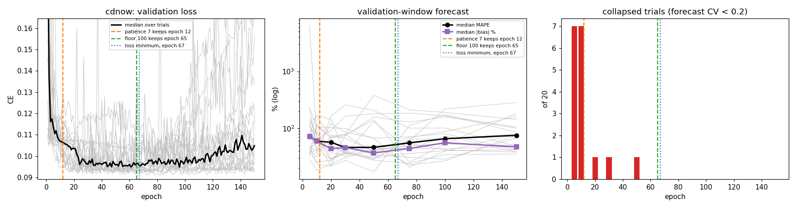
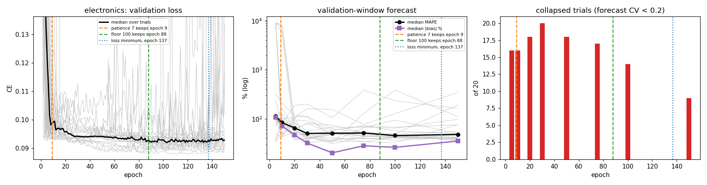
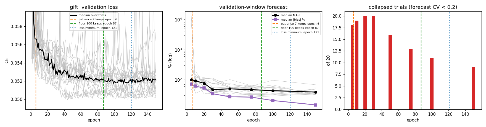
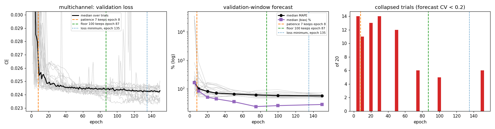

# Hyperparameter search

How the Optuna search that picks every neural model is set up, how each piece compares
with standard practice, what was measured, and what is still to test. Model selection
(whether the criterion picks the right trial) is in `docs/model-selection.md`; training
length is in `docs/insight-training-efficiency.md`.

It is not a grid search. Optuna's TPE sampler draws each trial's settings from what
earlier trials scored, so it concentrates on whatever the score favours. That makes the
score itself the first thing to get right (§3.1).

Conventions: every interval is a 95% percentile bootstrap from `evaluation.effects.effect`
(`docs/statistical-protocol.md`), and bold marks one that excludes 0. Family letters are
those of `docs/studies-run.md` §4.

## 1. How a study runs

One **study** is one search, its refit and its forecast. In order:

1. **Sample.** TPE, seeded `base_seed + i`, draws a trial's settings from the model's
   registry entry (`registry/model_registry.py`). Searched archives used 100 trials.
2. **Train.** `fit_model` (`training/loop.py`) trains with AdamW, gradient clipping at
   1.0 and cross-entropy against the count class, for at most `n_epochs` (100 in the
   archives).
3. **Stop early.** After each epoch it scores the validation window (ADR-0001). An epoch
   counts as an improvement only if it beats the best by an absolute 1e-4
   (`loop.py:377`). After `patience` epochs (7) without one, training stops, unless
   `min_epochs` has not been reached yet. The best epoch's weights are kept.
4. **Prune.** From the 4th epoch on, Optuna's `MedianPruner` stops a trial whose best loss
   so far is worse than the median of finished trials at the same epoch
   (`tuning/optuna_tuning.py:504`).
5. **Select.** The trial with the lowest validation loss wins.
6. **Refit.** The winner is fine-tuned for 5 epochs on the full calibration window at
   learning rate 1e-3 and batch 512 (`trials/refit.py`, ADR-0008).
7. **Forecast.** The refit model is rolled out over the holdout, averaged over 200–500
   paths.

### What is searched

| model | searched | fixed |
| --- | --- | --- |
| LSTM | hidden width {32, 64, 128}, dense width {32, 64, 128}, dropout 0–0.4, learning rate 1e-4–3e-3 (log), batch {32, 64, 128, 256} | embedder `valendin`, weight decay 0 |
| ValendinLSTM | learning rate 1e-4–3e-3 (log), batch {32, 64, 128, 256} | architecture 128/128, no dropout (ADR-0004); weight decay 0 |
| Transformer | `d_model` {32, 64, 128}, heads {2, 4, 8}, layers 1–3, dropout, learning rate, batch | embedder `valendin`, weight decay 0 |

**The archived searches used a different space.** Before 23 September 2026, weight decay
was searched over 1e-6–1e-2 (log) and batch over {64, 128, 256}; commits d7e902d and
57b8c18 pinned weight decay to 0 and added batch 32. Families T, T′, U and V
ran on the old space (and earlier families on older ones), so a rerun meant to reproduce
one must restore it (family U′ does, §4).

## 2. Against standard practice

| # | Piece | What this package does | Standard practice | Status |
| --- | --- | --- | --- | --- |
| 1 | Epoch loss | **was** a mean of per-batch means; now the per-cell mean | the per-sample mean (Keras metrics, Lightning's epoch logging) | **fixed**, ADR-0010 (§3.1) |
| 2 | Pruner | `MedianPruner`, warm-up 3 epochs, 5 startup trials | Optuna's defaults are warm-up 0, 5 startup trials; Optuna's own benchmark pairs **Hyperband** with TPE and the median rule with random search | open (§3.2) |
| 3 | Pruning unit | epochs | epochs: standard | noted (§3.2) |
| 4 | Improvement threshold | absolute 1e-4 | a threshold relative to the loss, or patience sized to the curve | open (§3.3) |
| 5 | Training floor | `min_epochs` under early stopping, pruner warm-up raised to match | not standard; a remedy for flat curves | open (§3.4) |
| 6 | Refit | lr 1e-3, batch 512, 5 epochs, fresh AdamW, whatever the search chose | fine-tune at the tuned learning rate or below | open (§3.5) |
| 7 | Sampler | TPE, seeded per study | standard | fine after #1 (§3.6) |

## 3. What was found

### 3.1 The validation score depended on the batch size (fixed)

Until commit af2b14b, `validate_one_epoch` returned the mean of its per-batch means. The
validation loader runs at the trial's batch size, in fixed customer order, so the short
last batch counted as much as a full one. At batch 256 on electronics, the 61 highest-id
customers carried 25% of the score instead of 7%.

Family U's stored winners, scored at every batch size with their weights fixed, against
the true per-cell mean:

| panel | the short batch's loss vs average | batch 64 | batch 256 |
| --- | ---: | ---: | ---: |
| electronics | 0.79× | −0.1% | **−4.1%** |
| multichannel | 0.29× | −0.3% | **−6.2%** |
| cdnow | 1.35× | +0.2% | **+2.8%** |
| gift | 2.28× | +3.0% | **+13.4%** |

- **The bias outweighed the real differences.** The winning loss varies by only 0.08–3.1%
  across replications (`docs/model-selection.md` §2).
- **TPE followed it.** Batch 256 was drawn in 61% and 51% of all electronics and
  multichannel trials, against 8–9% on CDNOW and gift.
- **Its direction is an accident.** On electronics and multichannel the highest ids buy
  less than average; on CDNOW and gift, more.

**The fix** weights each batch by the cells it scored (`_batch_weight`, `loop.py:67`), so
the score is the exact per-cell mean at any batch size. Shuffling the validation set was
rejected: at batch 256 it leaves a 95% range of ±3–9% around the true mean.

**The rerun** (family U′, electronics · `archive` · no cluster label, 20 replications per
model, `docs/model-selection.md` §3.9):

| | LSTM | ValendinLSTM |
| --- | --- | --- |
| winners at batch 256, archive → rerun | 18 → 2 of 20 | 19 → 1 of 20 |
| Δ MAPE | −3.0 [−7.5, +1.5] | **−9.4 [−16.0, −3.0]** |
| Δ bias % | −8.0 [−20.1, +4.0] | **−11.4 [−21.8, −1.6]** |
| Δ Spearman | +0.017 [−0.009, +0.044] | **+0.055 [+0.013, +0.099]** |

The fix removed the preference for batch 256. ValendinLSTM then trains longer and 5 of 20
runs no longer collapse. The LSTM moves to batch 64 but still stops after about 4 epochs
and collapses: the score was one cause of stopping too early, not the only one.

### 3.2 The pruner judges trials before their curves separate (open)

`MedianPruner` here starts at the 4th epoch, after 5 finished trials, and stops a trial
whose best loss so far is worse than the median of finished trials at that epoch. It
stopped 56–73% of trials per panel in the archive (48–50% in the U′ rerun).

- **The curves are flat at first.** With early stopping off, validation loss stays flat
  for 29–131 epochs before a run's own best (`docs/insight-training-efficiency.md` §3.2).
  At epoch 4 most trials look alike, so the rule mainly rewards those that drop fast
  early, not those that end best.
- **It compares trials at equal epochs.** That is the standard unit, but at the same
  epoch a batch-32 trial has made 8× more updates than a batch-256 trial.
- **It compared trials on the biased score of §3.1** in every archived search.
- **Which epoch trials were pruned at is not recoverable.** The per-epoch values lived in
  Optuna's in-memory storage and were never written out.

Proposed replacements, to be tested against the current rule and against no pruning
(`pruner=False`, already supported):

```python
optuna.pruners.HyperbandPruner(min_resource=10, max_resource=n_epochs, reduction_factor=3)
```

No trial is judged before epoch 10; survivors are re-ranked at about 30 and 90 epochs,
within groups of trials of similar age. On a floored arm, `min_resource` should equal
`min_epochs`.

```python
optuna.pruners.PatientPruner(
    optuna.pruners.MedianPruner(n_startup_trials=10, n_warmup_steps=10), patience=7)
```

Keeps the median rule but lets it fire only after 7 epochs without improvement, the same
patience early stopping uses.

Pruning may not be worth it at all: trials already stop after 8–25 epochs, so turning it
off may cost little GPU time.

### 3.3 The improvement threshold is absolute (open)

An epoch counts as an improvement only if it beats the best by 1e-4. That is 0.4% of
multichannel's validation loss (about 0.024) but 0.1% of CDNOW's (about 0.091), so the rule
is about four times stricter on multichannel. With patience 7 on flat curves, runs stop at
epochs 3–8 (`docs/insight-training-efficiency.md` §3.3). It is the leading suspect for the
LSTM's remaining collapse after §3.1's fix.

### 3.4 A training floor buys looking time, not late weights (open)

`min_epochs` stops early stopping from ending a run before the floor; the pruner's warm-up
is raised to match (`optuna_tuning.py:501–505`). It does not force the kept weights to come
from after it: 92% of the 440 floored runs kept weights from before their floor
(`docs/insight-training-efficiency.md` §8.2, Finding 6). `select_from_epoch` is the control
that does force late weights.

A floor has not been tested on top of §3.1's fix. It is the natural next test for the
LSTM's collapse on electronics.

### 3.5 The refit ignores the tuned learning rate and batch (open)

`refit_best_trial` runs at its defaults, and no experiment script passes `refit_kwargs`:
5 epochs at learning rate 1e-3 and batch 512, with a fresh AdamW. A fresh Adam's first
steps move each weight by about the learning rate, so a winner tuned at 1.6e-4 is
fine-tuned at six times its rate, on weights the validation set never scored.

This matches a lead in `docs/insight-training-efficiency.md` §8.2: with the cluster label,
runs that drew a low learning rate over-forecast more, and the two worst electronics
ValendinLSTM runs used 1.6e-4 and 5.8e-4. Not measured. The test: forecast each winner from
its checkpoint and from its refit, and relate the difference to its tuned learning rate.

### 3.6 The sampler converges (fine)

The median winner is trial 46–56 of 100, so TPE is still finding better trials late. In the
archive it converged on the biased score of §3.1; with the fix it converges on the true
one.

## 4. Runs

| family | what | status |
| --- | --- | --- |
| U′ | electronics · `archive` · no cluster label, rerun with the fixed score; archive search space restored | complete, §3.1 (`.scratch/score-fix/`) |
| EP | the epoch probe of §5.1: ValendinLSTM, 20 trials per panel, 150 epochs, no early stopping, no pruning | complete, §5.1 (76 items on vast.ai, 4 locally; $0.84) |

## 5. Tests owed

Every test changes one thing against a fixed-score baseline and is compared on MAPE, bias
and Spearman with independent bootstrap intervals, plus which batch, learning rate and
kept epoch the search picks, the number of collapsed runs, and GPU time per study.

| # | Test | Changes | Question |
| --- | --- | --- | --- |
| 0 | **Epoch probe** (§5.1) | nothing; every trial trains 150 epochs and its curve is recorded | when do trials become distinguishable, and when does a single run leave its flat start? Sets the pruner's warm-up and `min_epochs` from data |
| 1 | **Current vs new settings** | the fixed score plus a `min_epochs` floor set by test 0, ValendinLSTM, all four panels | do the two changes together improve the forecast? Baseline: family U `archive` · no cluster label (no rerun needed) |
| 2 | **Pruner** | current `MedianPruner` vs `HyperbandPruner` (`min_resource` from test 0, η = 3) vs none | does pruning at epoch 4 discard trials that would have won, and does pruning pay at all? |
| 2b | **Hyperband η** | η = 3 vs η = 2, only if test 2 favours Hyperband | does gentler pruning change the winners? |
| 3 | **Improvement threshold** | absolute 1e-4 vs a relative one, on multichannel | does the 4× stricter rule cut multichannel's training short? |
| 4 | **Refit learning rate** | checkpoint vs refit forecasts, related to each winner's tuned learning rate | does refitting at 1e-3 damage winners tuned at a low rate? |

### 5.1 Test 0: the epoch probe

**Why.** The pruner's warm-up (3 epochs) and the `min_epochs` floor (0, 50 or 90 in the
archive) were set by convention or precedent. Both should be set where the curves say:
- the **warm-up** (or Hyperband's first rung) where *trials* become distinguishable from
  one another, since pruning before that point discards trials at random;
- the **floor** past the point where a *single run* leaves its flat start, since early
  stopping before that point ends runs that had not begun to learn.

**Design.** `scripts/run_epoch_probe.py`, run on vast.ai.
- ValendinLSTM only, with count and week as inputs and no cluster label: family U's
  `archive` · no cluster label configuration, on all four panels.
- **20 trials per panel**, each a set of training settings drawn at random from the
  archive search space (learning rate 1e-4–3e-3 log, weight decay 1e-6–1e-2 log, batch
  {64, 128, 256}). Random rather than TPE, so the trials represent the space rather than
  one search's preferences. The same 20 draws on every panel, seeded from one config
  value.
- Each trial trains **150 epochs with no early stopping and no pruning**, under the fixed
  score (ADR-0010). The validation loss is recorded at every epoch.
- At epochs 5, 10, 20, 30, 50, 75, 100 and 150 the weights are **rolled out over the
  validation window** (warm-up on the periods before it, 100 paths) and scored with
  `compute_forecast_metrics` plus Spearman, the family V procedure. The holdout is never
  touched, so nothing chosen from this probe has seen the data it will be tested on.
- 80 work items (4 panels × 20 trials). Output per item in
  `Studies/epoch_probe__ValendinLSTM__<panel>__tNN/`: `history.csv` (per epoch) and
  `rollouts.csv` (per checkpoint), with `results.csv` written last as the completion
  marker the fleet tooling checks.

**Analysis** (`--report`), per panel:
- **Distinguishable:** the first epoch at which the trials' ranking agrees with their
  final ranking (rank correlation ≥ 0.8), by validation loss and by validation-rollout
  MAPE. This gives the warm-up.
- **Flat start:** for each trial, the first epoch whose validation loss beats epoch 1's by
  more than the stopping rule's 1e-4, and the epoch where it reaches half of its total
  improvement; the median over trials gives the floor. Alongside: the epoch at which
  patience 7 would have stopped each trial, and how far that is from its best.
- **Does early CE predict the forecast?** The final objective is forecasting, not
  teacher-forced CE, and §3.1 and `docs/model-selection.md` show the two can disagree. So
  for each epoch t the report also gives the rank correlation, across trials, between the
  CE at t (best so far, what the pruner and early stopping see) and the trial's final
  validation-rollout MAPE, |bias| and Spearman, signed so positive means low CE goes with
  a good forecast. The rollout MAPE at t is the comparison row. If CE tracks the final
  rollout from some epoch on, pruning on CE is safe from there and the warm-up goes
  there; if it never does, the warm-up and floor come from the rollout curve instead, or
  pruning is dropped. With 20 trials a single correlation is noisy (about ±0.4), so
  agreement across the four panels is what counts.
- Plots of validation loss and rollout MAPE against epoch, one line per trial.

The floor it gives replaces the 50 proposed for test 1, and the warm-up gives test 2's
`min_resource`.

#### Results (6 October 2026)

`python scripts/run_epoch_probe.py --report`; plots in `.scratch/epoch-probe/`. 20 trials
per panel, medians over trials unless stated.

**The validation loss falls fast, then slowly, for a long time.**

| | cdnow | electronics | gift | multichannel |
| --- | ---: | ---: | ---: | ---: |
| epoch where the loss first beats epoch 1's | 2 | 2 | 2 | 2 |
| epoch with half of the run's total drop | 3 | 3 | 3 | 4 |
| the run's own best epoch | 68 | 138 | 121 | 135 |
| where patience 7 stops it | 19 | 16 | 13 | 15 |
| loss given up by stopping there | 7.3% | 3.4% | 5.4% | 4.5% |
| trials rank as they will at the end (CE, ρ ≥ 0.8 from then on) | 24 | 69 | 76 | 54 |

There is no flat start in the loss: half of each run's drop happens by epoch 3–4. What
is slow is the rest. The loss keeps improving until epoch 68–138, while patience 7 ends
runs at epoch 13–19, before the trials can even be told apart (epoch 24–76).

**The forecast keeps improving long after patience 7 stops.** Validation-rollout medians
over the 20 trials, by epoch; *collapsed* counts trials with forecast CV < 0.2:

| panel | metric | 10 | 20 | 30 | 50 | 75 | 100 | 150 |
| --- | --- | ---: | ---: | ---: | ---: | ---: | ---: | ---: |
| cdnow | MAPE | 59.5 | 56.8 | **46.1** | 46.3 | 55.5 | 65.7 | 75.3 |
| | bias % | +59.5 | +37.0 | +23.7 | **+20.9** | +43.3 | +53.6 | +43.1 |
| | collapsed | 7 | 1 | 1 | 1 | 0 | 0 | 0 |
| electronics | MAPE | 83.6 | 64.9 | 50.2 | 50.7 | 51.2 | **45.5** | 47.9 |
| | bias % | +44.9 | +42.7 | +31.9 | +20.2 | +19.6 | +18.3 | **+15.5** |
| | collapsed | 16 | 18 | 20 | 18 | 17 | 14 | **9** |
| gift | MAPE | 92.0 | 76.1 | 47.2 | 49.8 | 46.8 | 43.3 | **38.8** |
| | bias % | +61.2 | +53.0 | +34.2 | +27.1 | +25.6 | +20.4 | **+12.1** |
| | collapsed | 19 | 20 | 20 | 16 | 13 | 11 | **9** |
| multichannel | MAPE | 100.6 | 80.8 | 70.5 | 65.6 | 61.0 | 57.8 | **56.4** |
| | bias % | +76.1 | +50.6 | +44.1 | +34.9 | +23.7 | +25.6 | **+18.1** |
| | collapsed | 11 | 13 | 14 | 12 | 6 | 5 | 6 |

- **On electronics, gift and multichannel the forecast improves to epoch 100–150.** From
  epoch 20, where patience 7 stops, to epoch 150, median MAPE falls by 17–37 points, the
  bias by 27–41 points, and the number of collapsed trials halves. The collapse of §8's
  failure type A is in large part training that stopped too early.
- **CDNOW is the exception.** Its forecast is best at epoch 30–50 and worsens after,
  while its loss keeps improving to epoch 68. Its calibration window is the shortest (39
  weeks against 104), and it over-fits first.

**Early CE predicts the final forecast on one panel only.** Rank correlation across
trials between the CE at epoch t and the final validation-rollout result, positive when
low CE goes with a good forecast:

| panel | CE at t → final MAPE | CE at t → final Spearman |
| --- | --- | --- |
| cdnow | about 0 at every t (+0.0 to +0.3) | **negative**, −0.26 to −0.56: lower CE, worse ranking |
| electronics | **negative** at epochs 1–10 (−0.25 to −0.38), −0.2 to +0.3 after | −0.15 to +0.46, unstable |
| gift | −0.1 to +0.3 | **+0.3 to +0.8**, mostly 0.5–0.7 |
| multichannel | **+0.2 to +0.8**, mostly above 0.5 | +0.3 to +0.8, at least 0.68 from epoch 20 |

Pruning compares trials on CE. On CDNOW and electronics, early CE is unrelated or opposed
to the forecast a trial ends with, so pruning there discards trials for a reason that
has nothing to do with forecasting. Even the rollout MAPE at an early epoch predicts the
final rollout poorly (ρ −0.2 to +0.6): forecasts reorder as training goes on.

**What this sets.**
- **Pruner (test 2): turn it off, or start it no earlier than epoch 50–75.** The current
  warm-up of 3 judges trials 20–70 epochs before their CE ranking settles, on a number
  that does not predict the forecast on two of four panels. Test 2 becomes current rule
  against no pruning; Hyperband only with `min_resource` ≥ 50.
- **Floor (test 1): about 100 epochs on electronics, gift and multichannel.** That is
  where the forecast stops improving and close to where the loss reaches its own best
  (121–138), so with the floor the CE-selected epoch lands where the forecast is good.
- **CDNOW needs less.** Its forecast is best at 30–50 and worse by 100. One floor for all
  four panels cannot be right; test 1 should use 100 on the three two-year panels and
  about 30 on CDNOW, or report CDNOW separately.

Limits: ValendinLSTM only; 20 trials, so a single correlation carries about ±0.4; the
rollouts are of the trained weights without the ADR-0008 refit; the archive search
space, sampled at random rather than by TPE.

### 5.2 Choosing the settings from calibration data only

**The aim.** Set every training and search setting using only data inside the
calibration window — the validation loss and the validation-window forecast — then freeze
them and touch the holdout once, for the final evaluation. If that works, the settings are
justified without any risk of having been tuned on the data they are judged on.

#### What the literature does

| Practice | References | Assumption | Holds here? |
| --- | --- | --- | --- |
| Early stopping on a validation split, the stopping rule chosen from validation curves | Prechelt (1998), *Early Stopping — But When?*; Bengio (2012), *Practical recommendations for gradient-based training*; Goodfellow et al. (2016) §7.8 | the rule should let a run reach its validation minimum | **yes** (below) |
| Validate on the forecasting task over the horizon, not on a one-step loss | Tashman (2000); M-competition practice | the validation score measures what is reported | **partly**: one-step CE does not track the forecast (§5.1, `docs/model-selection.md` §3) |
| Multi-fidelity search: pruning, Hyperband, learning-curve extrapolation | Li et al. (2018), *Hyperband*; Falkner et al. (2018), *BOHB*; Domhan et al. (2015) | trials rank early as they rank at the end | **no**: the CE ranking settles only at epoch 24–76 and early CE predicts the final forecast on one panel of four (§5.1) |
| Rolling-origin validation: several windows, not one | Tashman (2000); Bergmeir & Benítez (2012); Bergmeir, Hyndman & Koo (2018) | one validation window may not represent the next period | not tested yet |

The references are the standard attributions; their exact sections should be checked
before they are cited in the thesis.

#### The procedure, applied

1. **Pruning: off.** Its own assumption fails on the validation data.
2. **Stopping rule from the validation loss alone.** Replaying `fit_model`'s rule on the
   80 probe curves, patience 7 with no floor stops runs 3–7% above their own loss minimum;
   a floor of 100 epochs with patience 7 brings every panel within 0.7%. The floor only
   delays stopping and never forces late weights, so the epoch kept is still the one with
   the lowest validation loss (65 on CDNOW, where the loss turns back up after that).
3. **Check against the validation-window forecast**, still calibration data: does the rule
   chosen on the loss land where the forecast is good?

#### The curves

Each figure: left, the validation loss of the 20 trials (grey) and their median (black);
middle, the median validation-window MAPE and |bias| (trials in grey); right, how many of
the 20 trials have collapsed (forecast CV < 0.2). Dashed lines mark the median epoch kept
by the current rule (orange) and by the floor-100 rule (green); the dotted line is the
median epoch of the loss minimum. Regenerate with
`python scripts/run_epoch_probe.py --report --out docs/figures/epoch-probe`.









#### Did it work?

Each rule's validation-window forecast at the epoch it keeps, medians over the 20 trials.
The *oracle* row picks the single checkpoint with the best median validation forecast:
the best any epoch rule could do on this window. It also uses calibration data only, but
needs the rollouts, which the loss-based rule does not.

| panel | rule | epoch kept | MAPE | \|bias\| % | Spearman | collapsed of 20 |
| --- | --- | ---: | ---: | ---: | ---: | ---: |
| cdnow | patience 7 (current) | 12 | 65.1 | 65.1 | 0.09 | 4 |
| | **floor 100 + patience 7** | 65 | **44.9** | **42.1** | **0.26** | **0** |
| | oracle | 30 | 46.1 | 46.0 | 0.24 | 1 |
| electronics | patience 7 (current) | 9 | 79.3 | 64.6 | 0.02 | 17 |
| | **floor 100 + patience 7** | 88 | **43.7** | 28.3 | 0.05 | 14 |
| | oracle | 100 | 45.5 | 26.1 | 0.07 | 14 |
| gift | patience 7 (current) | 6 | 78.0 | 35.1 | 0.00 | 19 |
| | **floor 100 + patience 7** | 87 | 46.6 | 24.5 | 0.02 | 16 |
| | oracle | 150 | 38.8 | 14.6 | 0.09 | 9 |
| multichannel | patience 7 (current) | 8 | 99.3 | 80.5 | −0.00 | 9 |
| | **floor 100 + patience 7** | 87 | 63.6 | 29.8 | −0.00 | 9 |
| | oracle | 150 | 56.4 | 28.0 | 0.03 | 6 |

(The forecast is scored at the latest checkpoint at or before the epoch kept, since the
rollout was recorded at 8 epochs only.)

- **Yes on CDNOW and electronics.** The rule set from the loss alone matches the oracle:
  it closes all of the gap between the current rule and the best epoch (MAPE 65 → 45 and
  79 → 44). On CDNOW the loss itself turns up when the model starts to over-fit, so the
  loss-based rule stops in the right place without seeing a forecast.
- **Mostly on gift and multichannel.** It closes 80% and 83% of the MAPE gap (78 → 47
  against an oracle of 39; 99 → 64 against 56). The rest is training past epoch 100: the
  forecast is still improving at 150 while the floor-100 rule keeps epoch 87, because the
  loss has nearly flattened.
- **It does not fix customer ranking.** Spearman stays near 0 on electronics, gift and
  multichannel under every rule, and 9–16 of 20 trials remain collapsed. Training longer
  repairs the level of the forecast; ValendinLSTM without a customer-level input still
  cannot tell customers apart there (`docs/insight-training-efficiency.md` §8: the label
  is what lets it rank).

**Conclusion.** For the stopping rule and the pruner, calibration data alone is enough:
the loss says to stop no earlier than epoch 100, the loss-ranking test says not to prune
before the curves settle, and the validation forecast confirms the result on all four
panels. Two things remain before it can be claimed for the holdout:
- **another validation window** (rolling origin): the same replay on an earlier window
  inside calibration, to show the choice is not specific to one window;
- **one holdout test** with the settings frozen: test 1.

