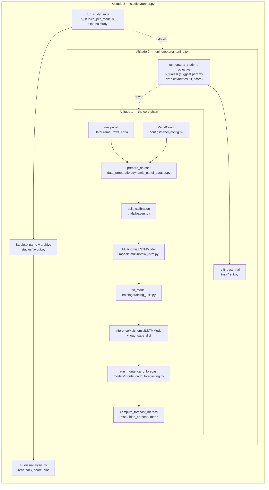
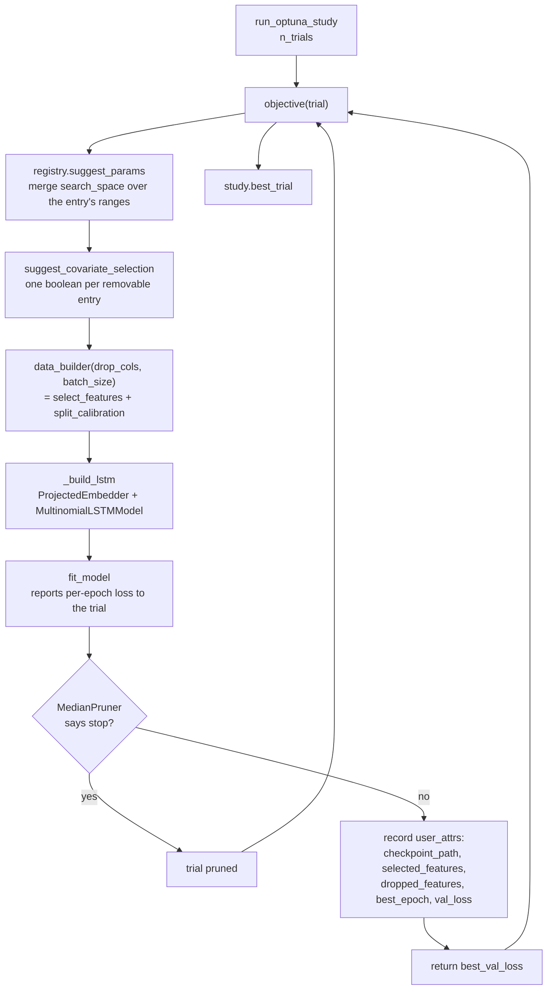
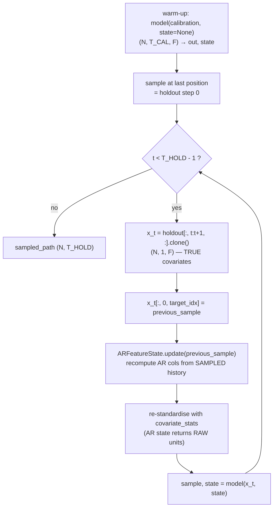

# Running a model

How a panel of customer transactions becomes a forecast and three numbers, and
which file does each part. The worked example throughout is the **LSTM**; the
Transformer, the Pareto/NBD baseline and the frozen Valendin benchmark each get a
section at the end describing only where they diverge.

Read `CONTEXT.md` first for the vocabulary (*calibration*, *holdout*, *rollout*,
*trial* / *study* / *study suite*). This document assumes it.

Every shape, value and file name below was produced by executing the pipeline, not
by reading the source. The numbers come from the golden fixture in
`tests/test_golden_end_to_end.py`, which is small enough to run in seconds.

## Contents

1. [The shape of the thing](#1-the-shape-of-the-thing)
2. [`PanelConfig` — declaring the panel](#2-panelconfig--declaring-the-panel)
3. [`prepare_dataset` — panel to tensors](#3-prepare_dataset--panel-to-tensors)
4. [Altitude 1 — the eight-call pipeline](#4-altitude-1--the-eight-call-pipeline)
5. [Altitude 2 — adding Optuna](#5-altitude-2--adding-optuna)
6. [From winning trial to inference model](#6-from-winning-trial-to-inference-model)
7. [The rollout](#7-the-rollout)
8. [Metrics](#8-metrics)
9. [Altitude 3 — the study suite](#9-altitude-3--the-study-suite)
10. [The archive, and reading it back](#10-the-archive-and-reading-it-back)
11. [The Transformer](#11-the-transformer)
12. [The Pareto/NBD baseline](#12-the-paretonbd-baseline)
13. [The frozen Valendin LSTM](#13-the-frozen-valendin-lstm)
14. [Gotchas and invariants](#14-gotchas-and-invariants)

---

## 1. The shape of the thing

Three ways to run a model live in this repo. They are not three pipelines — they
are one pipeline at three zoom levels, each adding exactly one concern to the one
below it.

| Altitude | Where | Adds |
|---|---|---|
| 1 | `tests/test_golden_end_to_end.py` → `run_lstm_pipeline()` | nothing — eight calls, no tuning |
| 2 | `notebooks/Data_integration_LSTM_v2.ipynb` | Optuna search + covariate-subset search |
| 3 | `scripts/run_studies.py`, `notebooks/Study.ipynb` | replication, archiving, analysis |

Altitude 1 is the one to read first. It is executable, and a test pins its output,
so it cannot quietly drift from what the package actually does.



---

## 2. `PanelConfig` — declaring the panel

`configs/panel_config.py` → `PanelConfig`. A frozen, self-validating dataclass that
is the **single** declaration of every column role, window date and embedding.
`prepare_dataset` accepts nothing else — pass a dict and it raises `TypeError`.

Priority 3 in `CLAUDE.md` lives here: columns are named in `PanelConfig`, never in
model code. Model code only ever sees positional feature axes.

This is the golden fixture's config, complete:

```python
PanelConfig(
    id_col="Id",                    # customer key; row order of every tensor
    target_col="Transactions",      # the counted thing — a CLASS, not a quantity
    frequency="weekly",             # period length; also picks the Pareto period_in_days
    training_start="2000-01-03",    # ─┐ calibration window: what the model
    training_end="2001-01-01",      # ─┘ trains on and warms up over
    validation_start="2000-10-02",  # temporal split (ADR-0001) INSIDE calibration
    holdout_start="2001-01-02",     # ─┐ the forecast window: never seen in
    holdout_end="2001-06-30",       # ─┘ training, never fed to the simulator
    time_cols=("year", "week"),     # how a period is identified when there is no date
    clip_target_upper=4,            # caps counts → sets the softmax head width
    time_features={                 # engineered calendar columns
        "add_year_idx": True,
        "add_week_sin_cos": True,
    },
    ar_features=(                   # target-derived; recomputed from SAMPLES at rollout
        "period_since_last_transaction",
        "cumulative_transactions",
    ),
    embedded_cols={"Transactions": "auto"},   # "auto" = infer cardinality from the data
)
```

Everything else takes a default: `date_col=None`, `periods_per_year=52`,
`require_calibration_activity=True`, and the four covariate-role tuples `time`,
`known_future`, `observed_past`, `static` all empty.

Two derived views the rest of the pipeline reads:

```python
config.schema
# {'target': ['Transactions'],
#  'time': ['week_sin', 'week_cos'],
#  'known_future_time_varying_inputs': [],
#  'observed_past_time_varying_inputs': [],
#  'static_covariates': []}
```

`schema` is what fixes **feature order** — the last axis of every tensor is
positional, so this ordering is part of the checkpoint contract.

Note what is *not* there: `add_year_idx=True` created a `year_idx` column in the
panel, but it did not join the `time` role and so never reaches the model. Only the
cyclical outputs (`week_sin`, `week_cos`) auto-join. See
[Gotchas](#14-gotchas-and-invariants).

**What a real config adds.** The archived electronics suites
(`Studies/cross_entropy_cfg_2y_Train_1yPred_NoCov_V1/config.json`) differ only in
degree: real dates spanning two calibration years and a one-year holdout, a larger
`clip_target_upper`, and — when covariates are used — populated `time` /
`known_future` / `static` tuples naming real columns. The structure is identical.
Every suite serialises its `PanelConfig` into its `config.json`, so any archived run
can be read back to see exactly which panel produced it.

---

## 3. `prepare_dataset` — panel to tensors

`data_preparation/dynamic_panel_dataset.py` → `prepare_dataset(panel, config, verbose=True)`.

One call. In: a long customer-period DataFrame. Out: a dict of numpy arrays plus
the bookkeeping everything downstream reads.

```python
data = prepare_dataset(panel, config, verbose=False)
```

The golden panel is `(1872, 4)` — 24 customers × 78 weeks, columns
`Id, year, week, Transactions`. What comes back:

```
N=23  T_CAL=52  T_HOLD=25  F=5
val_start_idx=39   (train periods 0..38, validation periods 39..51, V=13)
seq_cols   = ['Transactions', 'week_sin', 'week_cos',
              'period_since_last_transaction', 'cumulative_transactions']
target_col = 'Transactions' at index 0

calibration  (23, 52, 5)   float32    the training window, all features
holdout      (23, 25, 5)   float32    the forecast window — covariates only ever
samples      (23, 51, 5)   float32    calibration[:, :-1, :]
targets      (23, 51, 1)   float32    calibration[:,  1:, target_idx]
embedded_cols  {'Transactions': 5}    "auto" resolved → 5 classes (0..4)
```

**N is 23, not 24.** One synthetic customer never transacts during calibration and
is dropped by `require_calibration_activity`. That filter is what keeps the neural
models and the Pareto/NBD baseline scoring the same cohort.

**`samples` and `targets` are the next-step-prediction pairing**: feature row at
period *t* is asked to predict the count at *t+1*, which is why both are `T_CAL - 1`
long. `targets` holds class indices stored as float.

The dict also carries `covariate_stats` (calibration-fitted `{col: (mean, std)}`,
used again during the rollout), `ar_features`, `ids`, `n_val_periods`, the three
DataFrames `panel` / `train_panel` / `holdout_panel`, and the `panel_config` itself.

Inside, in order: time features → period index → AR columns registered → cohort
filter → target clipping (calibration only) → AR columns computed → window slicing →
`val_start_idx` → embedded-column resolution → reshape to `(N, T, F)` →
standardisation. **The target channel is never standardised** — it is a class index.

For the AR feature contract and why leakage is the failure mode that matters here,
read `docs/feature_engineering.md`. It is not repeated in this document.

---

## 4. Altitude 1 — the eight-call pipeline

`tests/test_golden_end_to_end.py` → `run_lstm_pipeline()`. The whole thing, no
tuning. It is one of four arms that file pins, one per model family;
`scripts/trace_golden_reachability.py` imports all four and runs them under a tracer,
so the reachability evidence and the pinned test describe one code path.

### 4.1 `split_calibration`

`trials/loaders.py` → `split_calibration(data, batch_size)`. Where numpy becomes
tensors, and the **sole enforcement point** of the temporal split (ADR-0001).

```python
split = split_calibration(data, batch_size=8)   # .train_loader / .val_loader / .recipe
```

| | X | y | note |
|---|---|---|---|
| train | `(8, 38, 5)` float32 | `(8, 38)` int64 | truncated at `val_start_idx - 1` |
| val | `(8, 51, 5)` float32 | `(8, 51)` int64 | **full** sequence |
| refit | `(8, 51, 5)` | `(8, 51)` | all transitions, via `refit_loader` |

The split is temporal, not customer-wise: **all 23 customers appear in both
loaders**, cut by date. The validation loader gets the *full* sequence because the
model needs the earlier periods as warm-up; `recipe["val_score_start"] = 38` tells
`fit_model` to score only from that position on. Passing the truncated sequence
instead would score a cold model.

The `recipe` also carries `seq_cols`, `embedded_cols`, `target_col` and `seq_len=38` —
this is what the embedder is built from, so the model never learns a column name. It
is a named field of `CalibrationSplit` rather than a trailing dict because every model
constructor downstream is rebuilt from it.

### 4.2 The embedder and the model

`models/embedders.py` → `ProjectedEmbedder`, and `models/multinomial_lstm.py` →
`MultinomialLSTMModel`. The embedder is a swappable component the model is *given*
(ADR-0005), not part of the architecture.

```python
embedder = ProjectedEmbedder(
    seq_cols=metadata["seq_cols"],
    embedded_cols=metadata["embedded_cols"],
    target_col=metadata["target_col"],
    embedding_dim=8,
)
model = MultinomialLSTMModel(embedder=embedder, lstm_hidden_size=8,
                             dense_units=8, dropout=0.0)
```

```
embedder:  (8, 38, 5)  →  (8, 38, 16)     output_dim = embedding_dim * 2
model:     (8, 38, 5)  →  (8, 38, 5)      logits (B, T, K), K = 5 classes
```

`output_dim` is `embedding_dim * 2` because the embedder sums the context channels
and concatenates the target. `num_target_classes = 5` comes from
`embedded_cols["Transactions"]`, which came from `clip_target_upper=4`. That chain —
config value → resolved cardinality → softmax width — is why changing
`clip_target_upper` changes the model's output shape.

The state dict is prefixed by the seam: `backbone.embedder.*`, `backbone.lstm.*`,
`backbone.dense.*`, `backbone.output_layer.*`. (Checkpoints predating ADR-0005 keep the
embedding modules directly under `backbone.*` and fail `load_state_dict(strict=True)`
against the current classes. The key-renaming migration that fixed them was applied and
then deleted once the archived checkpoints were; recover it from git history if a
pre-seam checkpoint ever resurfaces.)

### 4.3 `fit_model`

`training/training_utils.py` → `fit_model(...)`. Standard supervised training of a
classifier: `build_criterion` from `models/losses.py`, `AdamW`, per-epoch validation,
early stopping on validation loss, best weights written to disk.

```python
fit = fit_model(
    model, train_loader, val_loader,
    max_trans=n_classes,       # class COUNT, not the maximum class index
    n_epochs=2, patience=2, device="cpu",
    checkpoint_dir=str(tmp_path), model_name="golden",
    val_score_start=metadata["val_score_start"],
)
```

Returns a `FitResult`: `best_val_loss`, `best_val_f1`, `best_epoch`,
`checkpoint_path`, and `history` (per-epoch train/val loss, accuracy, F1). On the
golden run, `best_val_loss = 1.6929405132929485` after two epochs — the fixture is
deliberately undertrained.

When a `trial` is passed, `fit_model` also reports per-epoch loss to Optuna and
honours pruning. That is the only coupling between training and tuning.

### 4.4 The inference model

```python
inference_model = InferenceMultinomialLSTMModel(
    embedder=ProjectedEmbedder(...same args...),
    lstm_hidden_size=8, dense_units=8, dropout=0.0,   # ← must match exactly
)
inference_model.load_state_dict(torch.load(fit.checkpoint_path, map_location="cpu"))
```

Two public classes wrap **one** shared backbone. `_MultinomialLSTMBackbone` holds the
embedder, the LSTM, the dropout, the dense layer and the output layer — every weight
lives there, and its forward is `(x, state) → (logits, state)`. The two public classes
delegate to it and differ only in what they do with what comes back:

```python
class MultinomialLSTMModel(nn.Module):              # training
    def forward(self, x):
        logits, _ = self.backbone(x)                # state built, used, discarded
        return logits

class InferenceMultinomialLSTMModel(nn.Module):     # rollout
    def forward(self, x, state=None):
        logits, state = self.backbone(x, state)     # state accepted and returned
        probs = torch.softmax(logits, dim=-1)
        sample = dist.Categorical(probs=probs).sample().unsqueeze(-1).float()
        return sample, state
```

#### How training drives it

**The input is teacher-forced.** Channel `target_idx` of every feature row holds the
**true** count for that period. `prepare_dataset` built the pairing by shifting one
period: `samples = calibration[:, :-1, :]` against
`targets = calibration[:, 1:, target_idx]`. So the row for period *t* — carrying the
true count at *t* — is asked for the count at *t+1*.

**One call covers the whole sequence.** A batch is `(8, 38, 5)`: 8 customers, 38
periods, 5 channels. `nn.LSTM` unrolls all 38 steps inside that single call. The
hidden state is created as zeros, threaded internally across the 38 positions, and
thrown away on return — `MultinomialLSTMModel.forward` discards it with `logits, _`.
Nothing carries between batches, because each customer's whole sequence sits in its
own row.

**The output is scores, not counts.** `logits (8, 38, 5)` — one score per class, per
period, per customer — goes to `CrossEntropyLoss` against `(8, 38)` int64 class
indices. The loss is averaged over every position in the batch. On the validation
pass, `val_score_start` makes it skip the warm-up prefix and average only from that
position on.

Two consequences worth holding onto:

- **The model never sees its own output during training.** Its errors cannot
  accumulate, because the next input is always ground truth.
- **Gradients flow back through all 38 steps.** Backpropagation-through-time spans
  the full sequence in the batch, which is why `seq_len` is a memory cost as well as
  a modelling choice.

#### How the rollout drives it

The same weights, fed completely differently. Two phases:

| phase | input | state in | state out |
|---|---|---|---|
| warm-up | `(23, 52, 5)` — the whole calibration window, one call | `None` → zeros | the calibration summary |
| step × 24 | `(23, 1, 5)` — one period | previous step's state | next step's state |

The warm-up call returns a sample at every one of the 52 positions, but only the last
is used: it *is* the forecast for holdout step 0. Its real product is the state.

At each subsequent step the input row is assembled from three different sources:

- **the count channel** ← the **previous sample**, never the true holdout count;
- **the covariates** ← the **true** holdout values, which are legitimately known in
  advance (calendar features, planned promotions);
- **the AR channels** ← recomputed by `ARFeatureState` from the *sampled* history,
  then put back through `covariate_stats` so their units match what the warm-up used.

**The state is the whole memory.** It is a 2-tuple `(h, c)`, each of shape
`(num_layers=1, N, lstm_hidden_size)` — `(1, 23, 8)` in the fixture. Because the state
carries everything the model knows about the calibration window, a single period is
enough input per step. Without threading it, each step would have to re-read the
entire history.

**The head samples, it does not take the argmax.** `softmax` over the K classes, then
one draw from `Categorical(probs)`. The draw is the point: a forecast is the *mean of
many* draws, which estimates the expected count. Taking the argmax would collapse every
customer onto the modal class — usually zero — and produce a forecast with no
dispersion at all.

#### Side by side

| | `MultinomialLSTMModel` | `InferenceMultinomialLSTMModel` |
|---|---|---|
| forward signature | `(x)` | `(x, state=None)` |
| returns | `logits (B, T, K)` | `sample (B, T, 1)`, `state` |
| count channel holds | the true count | the previous **sample** (after warm-up) |
| periods per call | all of them (38) | 52, then 1 at a time |
| state at entry | zeros, every call | zeros once, then the previous state |
| state at exit | discarded | returned and reused |
| head | raw scores | softmax → `Categorical.sample()` |
| repetition | one pass per epoch | `n_simulations` simulated paths, averaged |
| holdout counts | not present | never read |

#### Why two classes rather than one flag

The backbone already returns `(logits, state)`, so a single class with a `sample=False`
argument could serve both. Three reasons it is split instead:

1. **The return types genuinely differ** — logits for the loss, a drawn class plus
   state for the rollout. The class docstring rejects a mode switch explicitly:
   *"sampling is the only inference behaviour the forecast needs, so it is hardcoded
   here (no mode switch)."*
2. **Sampling is the forecast mechanism, not post-processing** (ADR-0002). A separate
   class states that in the type system rather than in a comment.
3. **The published model is built this way.** A Keras LSTM's `stateful` flag cannot be
   changed after the model is built, so Valendin et al. train a `stateful=False` model
   and then copy its weights into a `stateful=True` twin for prediction.
   `benchmarks/valendin_lstm.py` mirrors that pair, and being a frozen reference
   implementation (ADR-0004) it will keep mirroring it. PyTorch does not require the
   split — its LSTM takes state as an argument — so in `models/` this shape is a
   choice, not a necessity.

**What it costs.** Both constructors take the same arguments and are written out
separately, so the two objects can disagree. `load_state_dict` only succeeds when
their shapes match, and it runs *after* training — on a study, after every trial has
finished. `_build_inference_model_for` exists to build both from one registry, which
reduces the risk without removing it. See
[Gotchas](#14-gotchas-and-invariants).

### 4.5 Forecast and score

```python
forecast = run_monte_carlo_forecast(inference_model, data, n_simulations=8,
                                    seed=7, device="cpu", return_simulations=False)
metrics = compute_forecast_metrics(forecast["actual"], forecast["prediction_mean"])
```

```
prediction_mean  (23, 25) float32     mean over simulated paths
actual           (23, 25) float32     data["holdout"][:, :, target_idx]
simulations      (8, 23, 25)          only when return_simulations=True
```

Golden metrics, reproduced exactly by this document's verification run:

```
rmse                  = 2.0019012702059444
bias_percent          = 247.03757225433526
mape_aggregate        = 247.03757225433526
```

Two epochs on 23 customers massively over-predicts (1200.75 predicted against 346
actual). The numbers pin *what the pipeline computes*, not how well it forecasts.
`bias_percent` and `mape_aggregate` coincide here only because the model
over-predicts in every single period; they are not the same quantity.

---

## 5. Altitude 2 — adding Optuna

`tuning/optuna_tuning.py` → `run_optuna_study(...)`. Everything from altitude 1 now
happens once per trial, with the hyperparameters *and the feature set* varying.

```python
study = run_optuna_study(
    model_type="lstm",
    data_builder=make_data_builder(data_full),
    search_space={
        "embedding_dim": {8}, "lstm_hidden_size": {8}, "dense_units": {8},
        "dropout": {0.0}, "learning_rate": (1e-3, 1e-2, "log"),
        "weight_decay": 0.0, "batch_size": {8},
    },
    training={
        "n_epochs": 2, "patience": 2, "checkpoint_dir": tmp, "seed": 42,
        "loss_type": "cross_entropy",
    },
    n_trials=2, device="cpu",
    study_name="probe", append_timestamp=False, summary_dir=tmp,
    removable_features=[("week_sin", "week_cos"), "cumulative_transactions"],
)
```

### 5.1 `search_space` and `training`

Two dicts, because they are two things. `search_space` overrides what the model
searches; `training` carries the controls that are not searched. Both read the same
small spec language, `registry.suggest_param`:

| spec | meaning |
|---|---|
| `{32, 64, 128}` set | categorical, sorted for reproducible order |
| `[64, 128, 256]` list | categorical, in the given order |
| `(0.0, 0.4)` | float, uniform |
| `(1e-4, 3e-3, "log")` | float, log scale |
| `(1, 3, "int")` | integer |
| `(0.0, 0.4, 0.1)` | float on a step grid |
| `0.0` scalar | **fixed** — no trial parameter registered |

Anything not supplied falls back per-key to the range the model's registry entry
declares. `search_space` keys are validated up front against that entry, so a typo
raises before the first trial rather than being silently ignored. `training` holds
`n_epochs`, `patience`, `checkpoint_dir`, `verbose`, `loss_type`, `class_weights`,
`focal_gamma`, `grad_clip`, `log_wandb` and `seed`; the first two are training
control but may still be handed a spec (`"patience": {5, 7, 9}`), so they go through
the same mini-language.

The scalar row is a trap — see [Gotchas](#14-gotchas-and-invariants).

### 5.2 The covariate-subset search

`removable_features` opts columns into the search. Each entry is a column or a group
toggled as a unit — `("week_sin", "week_cos")` keeps a cyclical pair together.
`suggest_covariate_selection` samples one boolean per entry and returns the dropped
names; `select_features` then slices the feature axis of the precomputed tensors.
Pure column slicing, so no data prep re-runs per trial.

**Each trial may therefore train on a different `F`.** In the verification run the
winning trial dropped three of five columns:

```
seq_cols after slicing: ['Transactions', 'period_since_last_transaction']
F: 2 | calibration: (23, 52, 2) | holdout: (23, 25, 2)
```

The target is never removable. This mechanism is what the `NoCov` in the archived
study names refers to.



### 5.3 What a trial leaves behind

Optuna's own `best_params` holds only what was *sampled*:

```python
{'embedding_dim': 8, 'lstm_hidden_size': 8, 'dense_units': 8,
 'learning_rate': 0.0023688639503640775, 'batch_size': 8,
 'use_week_sin+week_cos': True, 'use_cumulative_transactions': True}
```

Everything else rides on `best_trial.user_attrs`: `checkpoint_path`,
`selected_features`, `dropped_features`, `target_col`, `best_epoch`, `best_val_f1`,
`val_loss`. `run_optuna_study` also writes
`<run_name>_best.json` and `<run_name>_trials.csv` into `summary_dir`, and puts each
trial's checkpoint under `checkpoint_dir/<run_name>/`.

`keep_only_best_checkpoint=True` deletes the non-winning `.pth` files once the study
finishes. Long studies otherwise accumulate one checkpoint per trial.

---

## 6. From winning trial to inference model

The winner is a set of hyperparameters and a feature subset — not yet a model that
can forecast. One route turns it into one: the refit (ADR-0008).

**`refit_best_trial(study, data_full, model_type, ...)`.** Slice `data_full` to the
winning feature set and rebuild the training model from `best_trial.params`, then
`refit_full_calibration` warm-starts from the trial's checkpoint and trains
`DEFAULT_REFIT_EPOCHS = 5` more epochs over the **full** calibration window
(`refit_loader`) — no validation, no early stopping — and saves the *final* weights.
`build_inference_from_trial`, pointed at that new checkpoint, rebuilds the inference
model and loads them.

The reasoning is paper fidelity: Valendin et al. perform several fine-tuning epochs
using the entire calibration set after selection. The validation window is real data
the tuning run deliberately held back, and once hyperparameters are chosen, spending
it on training is free information. The cost is that the returned weights were never
validated — and that the published `rfm2lstm` behaviour (forecast the tuning
checkpoint as-is) is no longer expressible from this package.

**The two differ.** Same study, same seed, same simulator, measured before the
checkpoint route was removed:

```
checkpoint : rmse 1.726055127841468  bias_percent 182.33381502890174
refit      : rmse 1.691715748556194  bias_percent 173.121387283237
```

If a forecast does not match the val loss you remember from tuning, this is usually
why.

It returns `(inference_model, data_best)`, and **the forecaster must be fed
`data_best`**, never `data_full` — its `seq_cols` and `target_idx` match the trained
weights. Returning both together is what removes that footgun.

---

## 7. The rollout

`models/monte_carlo_forecasting.py`. Per ADR-0002 the simulator lives with the
model, because for this model family the simulator *is* the forecast mechanism.

A forecast is not a forward pass. It is: warm up on calibration, then step through
the holdout one period at a time, sampling a count and feeding that sample back.
Repeat `n_simulations` times and average.

`simulate_one_path` is the stateful (LSTM) version:

1. Feed the **whole calibration window** in one call. Its last-position sample *is*
   the forecast for holdout step 0, and the returned hidden state now summarises
   calibration.
2. For each step *t* thereafter, build a single period from the **previous sample**
   plus the **true holdout covariates** for that period, thread the state, sample.



Three things this diagram is drawn to make unmissable:

- **True holdout counts are never fed in.** `data["holdout"]` supplies covariates;
  its target channel is overwritten by the previous sample every step.
- **AR features are recomputed from the sampled history**, via `ARFeatureState`.
  Reading them from the holdout would be leakage — the exact failure
  `docs/feature_engineering.md` exists for.
- **The re-standardisation step is not decoration.** `ARFeatureState` returns raw
  units; the model was warmed up on standardised ones. Skipping the transform feeds
  a silent unit mismatch that no shape check can catch.

`run_monte_carlo_forecast` wraps this: seed once, upload the tensors once, run
`n_simulations` paths, stack and average. `actual` is pulled from the holdout for
scoring only — the test `test_forecast_never_reads_the_holdout` asserts a forecast
that matched the truth exactly would be evidence of leakage, not skill.

---

## 8. Metrics

`models.monte_carlo_forecasting.compute_forecast_metrics(actual, prediction_mean)` is
the **single scoring authority** (`CLAUDE.md`). Both arrays are `(N, T_HOLD)`.

| metric | definition |
|---|---|
| `rmse` | `sqrt(mean((pred - act)**2))` over the whole array |
| `bias_percent` | `100 * (pred.sum() - act.sum()) / act.sum()` — signed, total volume |
| `mape_aggregate` | per-period sums across customers, then `100 * Σ|act_t - pred_t| / Σ act_t` |

`mape_aggregate` is deliberately not per-customer MAPE: at customer level most
holdout periods are zero and the denominator explodes.

Everything delegates here — `studies/runner.py`, `studies/analysis.py` →
`study_metrics`, `evaluation/plot_utils.py` → `metrics_table`,
`evaluation/segment_analysis.py`. That is why tables, plots and archived results
agree to the last decimal. There is no exception: these three numbers are computed in
exactly one place in the package.

---

## 9. Altitude 3 — the study suite

`studies/runner.py` → `run_study_suite(config)`. One Optuna study is one sample from
a noisy process; the suite runs many and keeps everything.

`scripts/run_studies.py` is the headless entry point. There is no CLI and no config
file to edit — you edit `load_panel()`, the `PanelConfig` and `build_models()` in the
file itself, then run it. (`Studies/*/config.json` files are *written by* runs as
provenance; nothing reads them to drive one.)

```python
config = StudySuiteConfig(
    studies_base_path="/path/to/Studies",
    study_name="electronics_2026_06",
    data=data_full,                  # ONE prepare_dataset dict, shared by all models
    n_studies_per_model=5,
    n_simulations=600,
    base_seed=42,
    models=[
        ModelSpec(name="LSTM", model_type="lstm", n_trials=100,
                  search_space={"dropout": {0.0, 0.2, 0.4}, ...},
                  training={"n_epochs": 100, "patience": {5, 7, 9}}),
        ModelSpec(name="ParetoNBD", model_type="pareto_nbd"),
    ],
)
run_study_suite(config)
```

`studies/config.py` holds both dataclasses and `validate()`, which checks the base
directory exists, model names are unique, `model_type` is a key of the model
registry (`lstm`, `transformer`, `valendin_lstm`, `pareto_nbd`) and `data` carries
the required keys — all before any training starts.

For each neural model, for `i` in `1..n_studies_per_model`:

1. `seed = base_seed + i`, and a study directory `Optuna_Studies/study_{i:02d}`.
2. `training` is augmented with that seed and a per-study `checkpoint_dir` — **the
   runner owns the seed**, so a `ModelSpec` cannot accidentally pin one.
3. `run_optuna_study(..., sampler=TPESampler(seed=seed), append_timestamp=False)`.
4. `refit_best_trial` — the only route to a forecast-ready model (ADR-0008).
5. `registry.rollout_for(model_type)` runs the rollout at `n_simulations`.
6. Predictions to CSV, `compute_forecast_metrics`, one row appended.

Which simulator a model type gets is declared by its registry entry, not chosen
here — the recurrent models roll out through `run_monte_carlo_forecast` and the
Transformer through `run_monte_carlo_forecast_transformer`, and the wrong pairing
would produce a wrong forecast rather than an error.

Adding a model means one entry in `registry/model_registry.py` (ADR-0006): its
search space, how that space is sampled, how the training model is built, and the
rollout it forecasts through. Every model-type list in the package derives from that
table's keys.

---

## 10. The archive, and reading it back

`studies/layout.py` owns every path. It imports neither torch nor optuna, so the
directory contract is unit-testable on its own.

```
Studies/<study_name>/
    config.json                  whole-suite record, incl. serialised PanelConfig
    results.csv                  tidy: one row per (model, study)
    aggregated_LSTM.csv          written later by aggregate_suite_predictions
    LSTM/
        config.json              this model's spec + search space
        metrics.csv              per-study metrics for this model
        Optuna_Studies/
            study_01/
                study_01_best.json      winner: params, user_attrs
                study_01_trials.csv     every trial
                checkpoints/study_01/   per-trial .pth
                refit_checkpoints/      the refit's weights (ADR-0008)
            study_02/ ...
        Predictions/
            Prediction_1.csv     (N × T_HOLD) wide: id_col + week_0..week_{T-1}
            Prediction_2.csv ...
    ParetoNBD/
        config.json, metrics.csv, Predictions/Prediction_1.csv
```

`create_suite_root` refuses an existing folder unless `overwrite=True` — silently
writing into a previous suite would mix results.

`studies/analysis.py` reads this back, discovering models and studies from the tree
rather than being told:

| function | does |
|---|---|
| `load_model_predictions` | one model's prediction CSVs → arrays |
| `aggregate_suite_predictions` | mean across studies → `aggregated_<Model>.csv` |
| `study_metrics` | **re-scores stored CSVs** through `compute_forecast_metrics` |
| `compare_study_metrics` | models side by side |
| `group_metrics_suite_table` | metrics by customer segment |
| `plot_suite_forecast` | actual vs predicted, with an across-study band |
| `describe_dataset`, `describe_suite_dataset` | panel summaries |

`study_metrics` re-scoring from the CSVs rather than trusting `metrics.csv` is what
makes the archive self-checking: the reported number can always be regenerated from
the stored predictions.

Because the suite runs N studies per model, the honest summary of a model is a
**distribution**, not a single pooled number: one study's RMSE is one draw.
`study_metrics` and `compare_study_metrics` carry that — they re-score every study
separately, and `standard_deviation=True` / `confidence_interval=True` report the
across-studies spread alongside the mean. There is no per-*segment* equivalent:
`group_metrics_suite_table` scores the across-studies mean forecast, so it gives one
value per (group, metric) and no spread.

---

## 11. The Transformer

Same pipeline. Four divergences.

**1 — Search space.** Its registry entry declares `d_model {32,64,128}`,
`nhead {2,4,8}`, `num_encoder_layers (1,3,"int")`, `dropout (0.0,0.4)`, plus the
shared `learning_rate` / `weight_decay` / `batch_size`. `suggest_transformer_params`
resolves `d_model` and `nhead` first and raises `optuna.TrialPruned` when
`d_model % nhead != 0`, rather than narrowing the categorical domain per trial.

**2 — Embedding width is tied to the model width.** `_build_inference_model_for`
passes `embedding_dim=params["d_model"]` to the `ProjectedEmbedder`. There is no
separate `embedding_dim` knob.

**3 — The rollout carries history explicitly.** `simulate_transformer_path`, because
a Transformer has no recurrent state to thread:

```
step 0      : context = calibration                    → predict holdout 0
step t (>0) : context = [calibration, holdout 0..t-1]  → predict holdout t
```

Each appended row carries true covariates, the sampled count, and AR features
recomputed from sampled history — identical in *what* it conditions on, different in
*how* history is carried. The context preserves absolute ordering so the positional
encoding indexes holdout step *t* at `T_CAL + t`, matching training. A single-step
feed would reset the position to 0 and drop all history. The model is called with
`only_last=True`.

**4 — Dispatch.** Its registry entry declares `run_monte_carlo_forecast_transformer`
as its rollout, and
`build_inference_from_trial` drops a stale `_cached_mask` key before
`load_state_dict` (older checkpoints persisted the causal mask; a no-op for the LSTM).

Everything else — `PanelConfig`, `prepare_dataset`, `split_calibration`, `fit_model`,
the refit, `compute_forecast_metrics`, the archive — is unchanged.

---

## 12. The Pareto/NBD baseline

`benchmarks/pareto_benchmark.py`, reached through `studies/runner.py` →
`_run_pareto_model`. Not a neural model: no Optuna, no torch, no rollout.

`ModelSpec(name="ParetoNBD", model_type="pareto_nbd")` and the runner takes the other
branch. It fits a hierarchical-Bayes Pareto/NBD to `data["train_panel"]` and calls
`compute_pareto_predictions` once, producing an `(N, T_HOLD)` array of expected
counts.

Differences worth knowing:

- **One study, not N.** MCMC is reproducible under a seed rather than deterministic;
  the row records `study=1`, `objective=NaN`, and the seed actually used.
- **`Optuna_Studies/` is not created** (`model_dirs(..., make_optuna=False)`).
- **Expectations, not samples.** It does not simulate paths.
- **Same cohort, same actuals, same scorer.** Actuals come from
  `data["holdout"][:, :, target_idx]` in the same customer order, and metrics go
  through `compute_forecast_metrics`. That is what makes the comparison fair — and why
  `require_calibration_activity` matters.

`scripts/validate_pareto_benchmark.py` checks the pure-Python implementation against
R's `BTYDplus` on a synthetic cohort. It needs R on `PATH`.

---

## 13. The frozen Valendin LSTM

`benchmarks/valendin_lstm.py`. A layer-for-layer transcription of the reference
notebook's Keras model (`Original_paper_model/banking_transactions_demo.ipynb`):

```
week  ──► Embedding(52, 8) ──┐
                             ├─► concat (12) ──► LSTM(128) ──► Dense(128) ──► Dense(K)
trans ──► Embedding(K,  4) ──┘
```

That is the whole model: no normalisation, no projection to a common width, no
dropout, no covariate path. It reads week and transaction count only, both
categorical.

**Why it is not `MultinomialLSTMModel`.** Ours departs from the paper in ways nobody
chose: its embeddings pass through LayerNorm and a projection to a common width, and
it sums context while concatenating the target, giving a 256-wide LSTM input where
the paper's is 12. Renaming ours would give a benchmark that quietly differs from
what it claims to reproduce, so the two live side by side (ADR-0004). This module is
frozen; `MultinomialLSTMModel` is free to develop. It deliberately does **not** reuse
`_MultinomialLSTMBackbone` — sharing it would mean the frozen reference silently
followed every change to the model under development.

What *is* shared: the embedder seam, the training loop, the Monte Carlo simulator and
evaluation, applied identically to every model. That is what makes the comparison
isolate architecture.

**In the pipeline** it is `model_type="valendin_lstm"` and behaves like any other
neural model, with two differences:

- Its registry entry's search space holds **only** `learning_rate`, `weight_decay`
  and `batch_size`. The widths are the published `memory_units=128` /
  `dense_units=128` and never enter the search — tuning a width would quietly
  unfreeze the reference. Its builder reads no architecture params at all.
- `InferenceValendinLSTMModel` returns `(sample, state)` with the same contract as
  ours, so its entry declares `run_monte_carlo_forecast` — the identical stateful
  rollout, no special-casing.

Deliberate departures that stay: the temporal validation split (ADR-0001) and Optuna
tuning over training hyperparameters. Everything else matches.

**Standalone validation.** `scripts/validate_valendin_lstm.py` is the only script in
the repo with a real CLI:

```bash
python scripts/validate_valendin_lstm.py --data Datasets/trans.csv \
    --epochs 30 --n-simulations 30 --seed 42 --device cpu
```

It rebuilds the banking dataset from the reference notebook, trains under the
notebook's protocol and judges val loss ≈ 0.44 and bias < 1% against a tolerance
band. `tests/test_valendin_lstm.py` separately pins the per-layer parameter counts
against the notebook's `model.summary()`. The LSTM layer is the one line that cannot
match exactly — Keras carries one bias vector per gate, PyTorch two, so ours has
`4 * 128 = 512` more parameters. Framework convention, not an architectural choice.

---

## 14. Gotchas and invariants

Failure modes that surface late, silently, or both.

**Pinning an architecture hyperparameter to a scalar breaks the rebuild.** A scalar
in `search_space` is returned as-is and **no trial parameter is registered**, so it
never appears in `best_params`. But `build_inference_from_trial` rebuilds from
`study.best_trial.params` and indexes required keys directly. Pinning `dropout` to
`0.0` and running a study raises, after every trial has finished training:

```
KeyError: 'dropout'
  in _build_inference_model_for, optuna_tuning.py
```

Affects `embedding_dim`, `lstm_hidden_size`, `dense_units`, `dropout` for the LSTM
and `d_model`, `nhead`, `num_encoder_layers`, `dropout` for the Transformer.
**Workaround: pin with a one-element set — `{0.0}`, not `0.0`.** That registers a
categorical with a single choice, so the key reaches `best_params`. Non-architecture
scalars (`loss_type`, `n_epochs`, `weight_decay`) are unaffected.

**`observed_past` covariates are silently dropped.** Declared in that role, they are
removed from the schema with a `warnings.warn` and never enter the tensors, model or
simulator — the rollout would have to feed their true future values, which is
leakage. In a notebook the warning is easy to miss and the covariate simply does
nothing. Planned alternatives: encoder-only conditioning during warm-up, or lagging
them into `known_future`.

**`add_year_idx=True` does not put `year_idx` in `seq_cols`.** Only the cyclical
outputs (`week_sin`, `week_cos`) auto-join the `time` role. The column is created in
the panel but never reaches the model unless you name it in a covariate role.

**The target lives in both `seq_cols` and `embedded_cols`.** `Embedder` validates
this and raises otherwise. It is the AR input channel *and* the class being
predicted.

**`clip_target_upper` sets the softmax head width.** `clip_target_upper=4` →
`embedded_cols["Transactions"] = 5` → a 5-way head. Change it and every checkpoint
for that panel becomes unloadable.

**Training and inference constructors must match exactly.** The inference model
loads the trained model's `state_dict`. A mismatch fails at `load_state_dict` —
after training. `_build_inference_model_for` exists so both are built from one
registry rather than by hand twice.

**Feature order is part of the checkpoint contract.** The last tensor axis is
positional. A reordered `seq_cols` loads cleanly and reads the wrong channel —
`test_golden_feature_axis_is_pinned` exists for this.

**Feed the forecaster `data_best`, not `data_full`.** After a covariate search the
winning trial's model has a different `F`. Both `build_inference_from_trial` and
`refit_best_trial` return the sliced dict alongside the model for this reason.

**The refit's weights are not the tuning checkpoint's.** See section 6. If a forecast
looks unlike the val loss from tuning, that is usually why — the refit trains on the
validation window too, and nothing validates the weights it ends on.

**`max_trans` is a class count, not a maximum index.** Pass
`data["embedded_cols"][target_col]`, which is already the count.

**`selection_metric="rollout_composite"` is gone.** Trials are selected on validation
cross-entropy, full stop; `run_optuna_study` no longer takes a `selection_metric` (or
any `rollout_*`) argument. Archived `Studies/*/trials.csv` files still record the
attribute — every one of them reads `val_loss`. ADR-0003 records why the option went.

**A study folder will not be reused.** `create_suite_root` raises `FileExistsError`
unless `overwrite=True`.

**Long studies fill the disk with checkpoints.** One `.pth` per trial. Set
`keep_only_best_checkpoint=True` unless you need to rebuild a non-winning trial.
